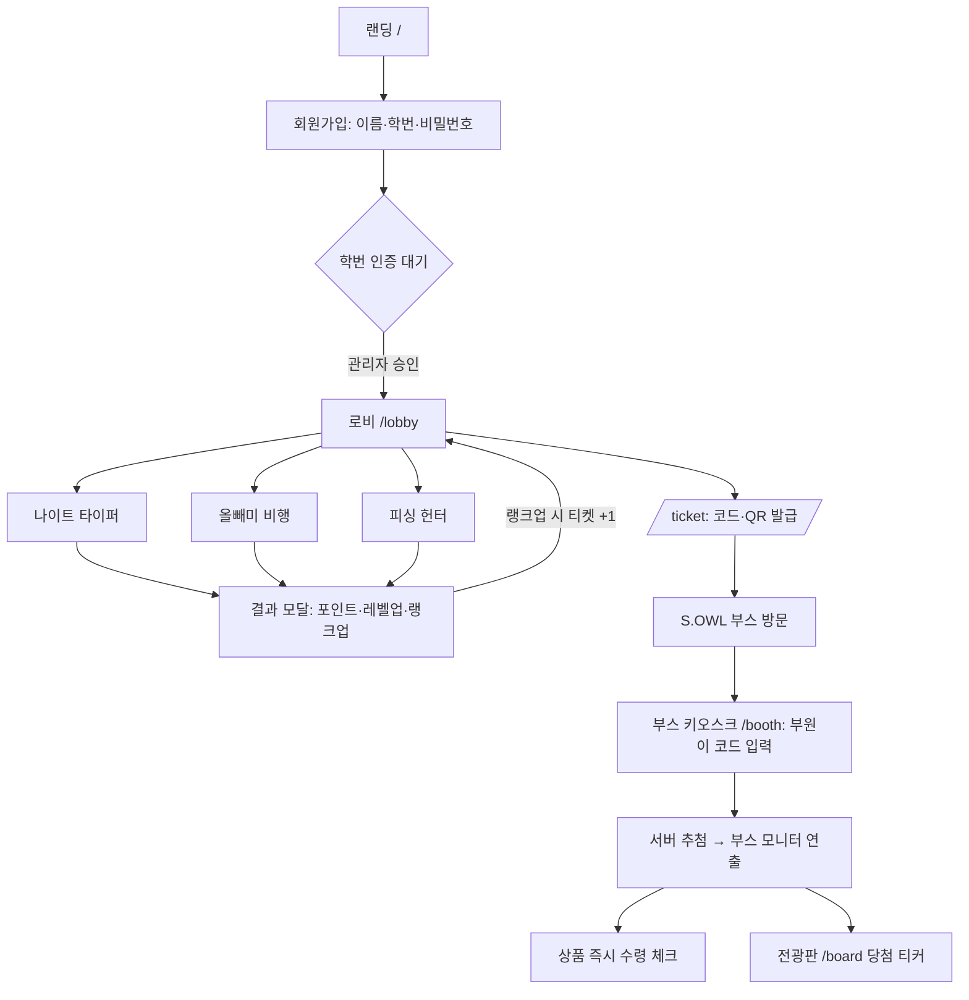
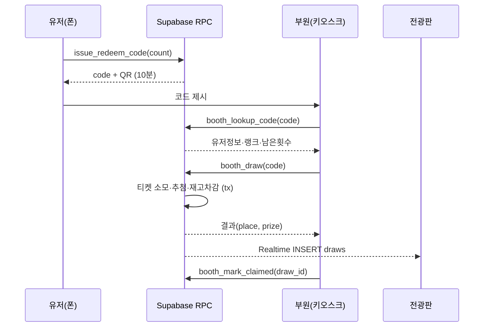
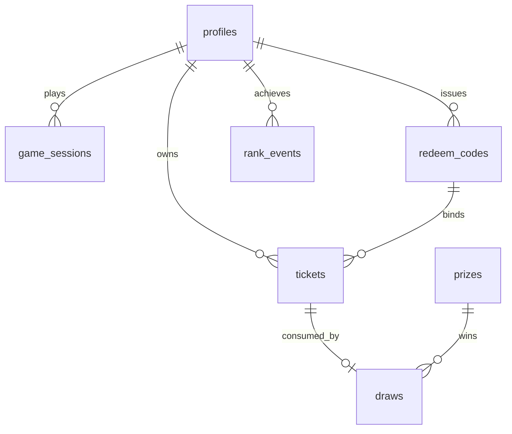

# 🦉 아울게임즈 (OWL GAMES) 설계 문서

> S.OWL 동아리 부스 행사용 웹 미니게임 플랫폼
> 이 문서는 Claude Code 구현용 명세서다. 여기 적힌 결정사항을 따르고, 명시되지 않은 부분은 합리적으로 판단해서 진행하되 `DECISIONS.md`에 기록할 것.

---

## 0. Claude Code 작업 지침

- 스택: **Next.js 15 (App Router) + TypeScript + Supabase (Auth / Postgres / Realtime) + Tailwind CSS**
- UI 언어: **한국어**
- **모바일 우선** 반응형 (방문객 대부분 폰으로 접속). 부스 키오스크·전광판은 태블릿/PC 가로 화면 기준.
- 게임은 **Canvas 2D + requestAnimationFrame** 으로 직접 구현. 게임 엔진 라이브러리 금지(번들 경량화).
- 이미지 에셋 없이 도형·이모지·CSS로 먼저 구현, 에셋은 나중에 교체 가능하게 컴포넌트 분리.
- **점수·포인트·레벨·티켓·추첨은 전부 서버(Postgres RPC, `security definer`)에서 처리.** 클라이언트는 절대 포인트를 직접 쓰지 못한다.
- 모든 테이블 RLS 활성화.
- 단계(§12) 순서대로 구현하고, 각 단계 끝에 수용 기준 체크.

---

## 1. 서비스 개요

| 항목 | 내용 |
|---|---|
| 목적 | 부스 방문 유도 + 동아리 홍보 + 보안 교육 |
| 핵심 루프 | 게임 플레이 → 포인트 → 레벨/랭크 상승 → 뽑기 티켓 → **S.OWL 부스 방문** → 뽑기 → 상품 수령 |
| 운영 시간 | 09:00 ~ 18:00 (Asia/Seoul). 시간 외에는 게임 시작 불가 |
| 뽑기 | **온라인에서는 불가.** 웹은 티켓·코드 발급과 부스 안내만 담당. 추첨은 부스 키오스크에서 부원이 진행 |
| 컨셉 | "밤에 깨어있는 부엉이 = 해커". 다크 네이비 + 네온 앰버, 터미널풍 |

---

## 2. 전체 흐름



---

## 3. 역할 (role)

| role | 권한 |
|---|---|
| `user` | 플레이, 본인 기록 조회, 티켓 코드 발급 |
| `staff` | + `/booth` 키오스크 (코드 조회, 추첨, 수령 처리), 가입 승인 |
| `admin` | + `/admin` 전체 (계정 삭제, 재고, 설정, 운영시간 강제 ON/OFF, 로그) |

---

## 4. 페이지 / 라우트

| 라우트 | 접근 | 내용 |
|---|---|---|
| `/` | 전체 | 로고, 운영시간, 현재 운영중 여부, 시작 버튼 |
| `/auth/signup` | 비로그인 | 이름·학번·비밀번호. 학번 중복 시 "이미 등록된 학번입니다. S.OWL 부스/관리자에게 문의하세요." |
| `/auth/login` | 비로그인 | 학번 + 비밀번호 |
| `/pending` | 미인증 유저 | "학번 인증 대기중" 안내 + 부스 위치. Realtime으로 승인되면 자동 로비 이동 |
| `/lobby` | 인증 유저 | 랭크 뱃지, Lv, 경험치 바, 보유 티켓 배너, 게임 카드 3개, 미니 랭킹 TOP10 |
| `/game/typer` `/game/flight` `/game/phish` | 인증 유저 | 게임 → 결과 모달 |
| `/rank` | 인증 유저 | 전체 랭킹(누적 포인트), 게임별 최고기록 탭 |
| `/ticket` | 인증 유저 | 티켓 목록, 현재 랭크 기준 뽑기 확률표, 코드·QR 발급, 부스 위치·지도·운영시간 |
| `/me` | 인증 유저 | 플레이 기록, 뽑기 내역, 수령 상태 |
| `/booth` | staff+ | 키오스크 모드 (§8) |
| `/board` | 공개(읽기 전용) | 부스 TV 전광판 (§9) |
| `/admin` | admin | 가입 승인, 유저 검색/삭제, 상품 재고, 설정, 로그 |

미들웨어에서 role·verified·운영시간 체크 후 리다이렉트.

---

## 5. 레벨 / 랭크 시스템

### 5.1 레벨 곡선
- 최대 레벨 **100**
- 레벨 L → L+1 필요 포인트: `30 + 5 × L`
- 레벨 L 도달 누적 포인트: `30(L−1) + 5(L−1)L/2`
- Lv100 누적 = **27,720P** (1판 평균 150P 기준 약 185판, 약 4.5시간 → 하루 챌린저 1~3명 목표)
- 계수는 `app_config.level_curve`에서 조정 가능하게 구현

### 5.2 랭크 구간 (rank_idx 0~16)

| idx | 랭크 | 레벨 | 뽑기 티어 |
|---|---|---|---|
| 0 | 나무 | 1~7 | T1 |
| 1 | 돌 | 8~14 | T1 |
| 2 | 아이언 | 15~21 | T1 |
| 3 | 브론즈 | 22~27 | T2 |
| 4 | 실버 | 28~33 | T2 |
| 5 | 골드 | 34~39 | T2 |
| 6 | 플래티넘 | 40~45 | T3 |
| 7 | 에메랄드 | 46~51 | T3 |
| 8 | 다이아몬드 | 52~57 | T3 |
| 9 | 루비 | 58~63 | T4 |
| 10 | 사파이어 | 64~69 | T4 |
| 11 | 흑요석 | 70~75 | T4 |
| 12 | 마스터 | 76~81 | T5 |
| 13 | 그랜드 마스터 | 82~87 | T5 |
| 14 | 초월자 | 88~93 | T5 |
| 15 | 신화 | 94~99 | T5 |
| 16 | **챌린저** | **100** | T6 |

> 원본 기획표에 "신화" 확률이 누락되어 T5에 포함함.

### 5.3 티켓
- 랭크 상승 1회당 티켓 1장 → 나무 시작이므로 **최대 16장 = 1인 최대 뽑기 16회** (별도 제한 로직 불필요, 구조적으로 보장)
- 한 번에 여러 랭크를 건너뛰면 건너뛴 만큼 지급
- **뽑기 확률은 "뽑는 시점의 현재 랭크" 기준** → 티켓을 모아뒀다가 랭크 올리고 뽑는 전략 허용 (의도된 설계, `/ticket`에 안내 문구 표시)

---

## 6. 뽑기 확률 / 상품

`app_config.gacha_table`에 JSON으로 저장. 아래는 초기값(%)이며, 합계 나머지는 꽝.

| 티어 | 1등 게이밍PC | 2등 마우스 | 3등 장패드 | 4등 과자 | 5등 젤리 | 당첨 합계 |
|---|---:|---:|---:|---:|---:|---:|
| T1 | 0.01 | 0.5 | 3 | 10 | 20 | 33.51 |
| T2 | 0.02 | 0.8 | 4 | 12 | 23 | 39.82 |
| T3 | 0.03 | 1.2 | 5 | 14 | 26 | 46.23 |
| T4 | 0.05 | 1.6 | 6.5 | 16 | 28 | 52.15 |
| T5 | 0.08 | 2.2 | 8 | 18 | 30 | 58.28 |
| T6 | 0.10 | 3.0 | 10 | 20 | 32 | 65.10 |

### 추첨 규칙
1. 서버 RPC에서만 추첨. 난수는 `gen_random_bytes` 기반.
2. **재고 0인 등수는 제외**하고, 그 확률은 꽝으로 흡수 (상위로 재분배 금지 → 비용 폭주 방지).
3. 추첨·재고 차감은 한 트랜잭션에서 `select ... for update`로 처리.
4. 결과는 `draws`에 기록, 전광판으로 Realtime 전송.

---

## 7. 게임 명세

### 공통
- 시작 시 `start_game_session(game)` RPC → `session_id` 발급 (운영시간·인증·동시 세션 체크)
- 종료 시 `submit_game_session(session_id, raw_score, meta)` RPC → 서버가 포인트 계산·지급·레벨/랭크/티켓 갱신 후 결과 반환
- 포인트 환산: `points = 30 + min(270, floor(raw_score / K_game))` → **1판 30~300P**
- 결과 모달: 원점수, 획득 포인트, 경험치 바 애니메이션, 레벨업/랭크업 풀스크린 연출, 티켓 획득 알림
- 로비에서 [다시하기] 원탭

### 7.1 🎮 나이트 타이퍼 (`typer`)
- **컨셉:** 해킹중인 부엉이. 떨어지는 명령어를 타이핑해서 방화벽 돌파
- **시간:** 60초 고정
- **규칙:**
  - 위에서 명령어 블록이 떨어지고, 입력창에 정확히 치고 Enter 누르면 파괴
  - 바닥에 닿으면 방화벽 게이지 +20%, 100%가 되면 조기 종료
  - 연속 성공 콤보: 1.0 → 1.2 → 1.5 → 2.0 (최대)
  - 시간이 지날수록 낙하 속도·단어 길이 증가
- **원점수:** Σ(글자수 × 콤보배율 × 10)
- **K:** 4 (초기값)
- **단어 풀 예시** (`/data/typer-words.ts`, 3단계 난이도, 각 40개 이상 생성할 것):
  - 쉬움: `ls`, `cd`, `pwd`, `ping`, `whoami`, `exit`
  - 보통: `sudo su`, `git push`, `chmod 777`, `cat flag`, `nmap -sV`
  - 어려움: `ssh root@owl`, `docker compose up`, `rm -rf /tmp/*`, `curl -X POST`
- **모바일:** 입력창을 하단에 고정하고, 키보드가 올라와도 플레이 영역이 보이도록 `visualViewport`로 캔버스 높이 조정

### 7.2 🦉 올빼미 비행 (`flight`)
- **컨셉:** 한밤 캠퍼스를 나는 부엉이 (원버튼 아케이드)
- **조작:** 탭/클릭/스페이스 = 날갯짓, 중력 낙하
- **장애물:** 가로등(상하 기둥 쌍), 전깃줄(수평), 🐛 버그 몬스터(상하 이동)
- **아이템:** ☕ 커피(무적 3초), ⭐ 별(+20)
- **난이도:** 거리에 비례해 스크롤 속도 증가, 틈 간격 감소
- **원점수:** 생존거리(m) + 별 × 20
- **K:** 3
- **최대 시간:** 180초 도달 시 자동 클리어 종료 (세션 검증 상한용)

### 7.3 🎣 피싱 헌터 (`phish`)
- **컨셉:** 보안관 부엉이. 메일·문자·URL 카드를 보고 진짜/피싱 판별
- **시간:** 90초
- **조작:** 카드 좌 스와이프 = 🚨 피싱, 우 스와이프 = ✅ 정상 (PC는 ←/→ 키, 버튼도 제공)
- **규칙:** 정답 +100 × 연속보너스(1 + 0.1 × streak, 최대 2.0), 오답 시 −5초 + 해설 1초 표시
- **원점수:** 정답 점수 합
- **K:** 10
- **카드 데이터** (`/data/phish-cards.ts`, 최소 60장, 정상:피싱 = 4:6 비율로 생성할 것):
```ts
type PhishCard = {
  id: string;
  kind: 'url' | 'sms' | 'email';
  sender?: string;
  title?: string;
  body: string;
  isPhish: boolean;
  explain: string; // 오답 시 표시할 한 줄 해설
};
// 예시
{ id:'u01', kind:'url', body:'https://naver.com/login', isPhish:false, explain:'공식 도메인' }
{ id:'u02', kind:'url', body:'https://naver-security.co/login', isPhish:true, explain:'naver.com이 아닌 유사 도메인' }
{ id:'s01', kind:'sms', sender:'+82 10-****', body:'[CJ대한통운] 주소 불일치로 배송 보류. 확인: bit.ly/xxxx', isPhish:true, explain:'단축URL + 개인번호 발신' }
{ id:'e01', kind:'email', sender:'notice@skhu-ac.kr', title:'[학사] 수강신청 계정 재인증 필요', body:'24시간 내 미인증 시 계정 정지', isPhish:true, explain:'학교 도메인 사칭 + 긴급성 압박' }
```
- 한 판 안에서 카드 중복 없이 셔플

---

## 8. 부스 키오스크 `/booth` (staff)

### 8.1 유저 측 `/ticket`
- 미사용 티켓 N장 표시
- [뽑기 코드 발급] → 사용할 장수 선택(1~N) → **6자리 영숫자 코드 + QR** (10분 만료)
- 만료되면 티켓은 자동으로 미사용 상태 복귀, 재발급 가능
- 활성 코드는 유저당 1개 (새로 발급하면 이전 코드 무효)
- 안내 카드: "🦉 S.OWL 부스로 와서 이 코드를 보여주세요" + 부스 위치(`app_config.booth_location`: 건물·층·지도 이미지 URL) + 운영시간

### 8.2 키오스크 화면 (태블릿 가로)
```
[코드 입력 / QR 스캔]
   ↓ booth_lookup_code
[유저 카드] 이름 · 학번 · 랭크 뱃지 · 티어 · 남은 뽑기 N회   ← 부원이 학생증과 대조
   ↓ [🎰 뽑기] 버튼
[연출] 캡슐 머신 애니메이션 3~4초 → 등수 공개 (1~2등은 특수 연출)
   ↓
[결과] 상품명 · [✅ 수령 완료] 버튼
   ↓ 남은 횟수 > 0 이면 [다음 뽑기], 아니면 [처음으로]
```
- QR 스캔은 `html5-qrcode` 등 경량 라이브러리 사용
- 연출은 클라이언트에서 하되, **결과는 추첨 RPC가 반환한 값만** 표시
- 미수령 결과는 `/admin`에서 목록 확인 가능



---

## 9. 전광판 `/board`

- 풀스크린, 가로 16:9, 폰트 크게
- 좌측: 실시간 랭킹 TOP 10 (누적 포인트, 랭크 뱃지)
- 우측 상단: 오늘 통계 (참가자 수, 총 플레이 수, 챌린저 수)
- 우측 하단: 남은 상품 재고
- 하단 티커: "🎉 홍*동 님 3등 장패드 당첨!", "⬆️ 김*수 님 다이아몬드 달성!"
- 이름은 **가운데 글자 마스킹**
- Realtime 구독: `draws` INSERT, `rank_events` INSERT → 랭킹은 5초 디바운스로 재조회

---

## 10. 데이터베이스

### 10.1 ERD


### 10.2 스키마 (초안 — 마이그레이션으로 작성)
```sql
create type user_role as enum ('user','staff','admin');
create type game_id as enum ('typer','flight','phish');

create table profiles (
  id uuid primary key references auth.users on delete cascade,
  name text not null,
  student_id text not null unique,
  role user_role not null default 'user',
  verified boolean not null default false,
  total_points int not null default 0,
  level int not null default 1,
  rank_idx int not null default 0,
  created_at timestamptz not null default now()
);

create table game_sessions (
  id uuid primary key default gen_random_uuid(),
  user_id uuid not null references profiles on delete cascade,
  game game_id not null,
  started_at timestamptz not null default now(),
  submitted_at timestamptz,
  raw_score int,
  points int,
  meta jsonb,
  status text not null default 'active'
    check (status in ('active','submitted','rejected','expired'))
);
create unique index one_active_session on game_sessions(user_id) where status = 'active';

create table redeem_codes (
  id uuid primary key default gen_random_uuid(),
  user_id uuid not null references profiles on delete cascade,
  code text not null,
  ticket_count int not null,
  expires_at timestamptz not null,
  status text not null default 'active' check (status in ('active','used','expired','revoked')),
  created_at timestamptz not null default now()
);
create unique index active_code on redeem_codes(code) where status = 'active';

create table tickets (
  id uuid primary key default gen_random_uuid(),
  user_id uuid not null references profiles on delete cascade,
  earned_rank_idx int not null,
  status text not null default 'unused' check (status in ('unused','reserved','used')),
  redeem_code_id uuid references redeem_codes,
  created_at timestamptz not null default now(),
  used_at timestamptz
);

create table prizes (
  place int primary key check (place between 1 and 5),
  name text not null,
  stock int not null check (stock >= 0)
);

create table draws (
  id uuid primary key default gen_random_uuid(),
  ticket_id uuid not null unique references tickets,
  user_id uuid not null references profiles,
  rank_idx int not null,
  tier int not null,
  place int references prizes,   -- null = 꽝
  staff_id uuid not null references profiles,
  claimed boolean not null default false,
  claimed_at timestamptz,
  drawn_at timestamptz not null default now()
);

create table rank_events (
  id bigserial primary key,
  user_id uuid not null references profiles on delete cascade,
  from_rank int not null,
  to_rank int not null,
  created_at timestamptz not null default now()
);

create table app_config (
  key text primary key,
  value jsonb not null
);
-- keys: open_hours {"start":"09:00","end":"18:00","tz":"Asia/Seoul"},
--       force_open ("auto"|"open"|"closed"),
--       level_curve {"base":30,"step":5},
--       game_k {"typer":4,"flight":3,"phish":10},
--       game_limits {"typer":{"min_sec":55,"max_sec":65},"flight":{"min_sec":3,"max_sec":185},"phish":{"min_sec":20,"max_sec":95}},
--       gacha_table (§6), booth_location {...}
```

### 10.3 RPC (전부 `security definer`, `search_path` 고정)

| 함수 | 호출자 | 역할 |
|---|---|---|
| `is_open()` | 내부 | 운영시간 + force_open 판정 |
| `level_from_points(p)` / `rank_from_level(l)` | 내부 | §5 계산 |
| `start_game_session(game)` | user | verified·운영시간 체크, 기존 active 세션 expire 처리 후 신규 발급 |
| `submit_game_session(session_id, raw_score, meta)` | user | 본인 세션·경과시간이 `game_limits` 범위 안인지 검증 → 포인트 계산 → profiles 갱신 → 랭크업 시 `rank_events`·`tickets` INSERT → 결과 JSON 반환 `{points, level_before, level_after, rank_before, rank_after, tickets_gained}` |
| `issue_redeem_code(count)` | user | 기존 active 코드 revoke·티켓 복귀 → unused 티켓 count장 reserved → 코드 생성(혼동문자 0/O/1/I 제외) |
| `booth_lookup_code(code)` | staff | 만료 체크 후 유저정보·현재 랭크·티어·남은 reserved 수 반환 |
| `booth_draw(code)` | staff | reserved 티켓 1장 used → 현재 랭크 티어로 추첨(재고 0 등수 제외) → 재고 차감 → draws INSERT → 결과 반환. 남은 티켓 0이면 코드 used |
| `booth_mark_claimed(draw_id)` | staff | 수령 처리 |
| `admin_verify_user(user_id)` | staff | verified = true |
| `admin_delete_user(user_id)` | admin | auth.users 삭제(cascade) — 학번 중복 해결용 |
| `expire_stale()` | cron | 만료 코드·세션 정리 (pg_cron 1분, 없으면 조회 시점 lazy 처리) |

### 10.4 RLS
- `profiles`: 본인 select. 랭킹은 **뷰 `leaderboard`** (name 마스킹, rank_idx, level, total_points)로만 공개
- `game_sessions`, `tickets`, `redeem_codes`, `draws`: 본인 select만. insert/update는 RPC 경유만
- `prizes`: 전체 select (재고 공개), 수정은 admin
- `app_config`: 전체 select (민감값 없음), 수정은 admin
- `draws`, `rank_events` Realtime용: 전광판은 마스킹 뷰 또는 공개 필드만 전송되게 구성

---

## 11. 인증 / 보안

- **Supabase Auth 이메일 매핑:** 가입 시 `${student_id}@owlgames.local` 을 이메일로 사용, 이메일 확인 OFF. 유저에게는 학번만 노출
- 가입 트리거: `auth.users` INSERT → `profiles` 생성 (name, student_id는 `raw_user_meta_data`에서)
- 학번 형식 검증: 숫자 9자리 (정규식은 config로)
- **학번 인증:** 가입 후 `verified=false` → `/pending`. 부원이 `/admin` 또는 `/booth`의 "가입 승인" 탭에서 학생증 대조 후 승인
- **점수 어뷰징 방어 (부스 행사 수준):**
  - 1판 최대 300P 상한 + 세션 경과시간 검증 → 조작해도 실제 플레이 시간만큼만 이득
  - 유저당 active 세션 1개
  - `submit` 레이트리밋: 같은 유저 연속 제출 최소 간격 = 게임 min_sec
  - 비정상 제출(시간 범위 밖, 음수, 상한 초과)은 `rejected` 기록 → admin 로그에서 확인
- 운영시간 외 `start_game_session` 거부 (프론트는 안내 배너, 서버가 최종 판단)

---

## 12. 디렉토리 구조

```
owlgames/
├─ app/
│  ├─ page.tsx                    # 랜딩
│  ├─ auth/{login,signup}/page.tsx
│  ├─ pending/page.tsx
│  ├─ lobby/page.tsx
│  ├─ game/[id]/page.tsx
│  ├─ rank/page.tsx
│  ├─ ticket/page.tsx
│  ├─ me/page.tsx
│  ├─ booth/page.tsx
│  ├─ board/page.tsx
│  └─ admin/page.tsx
├─ components/
│  ├─ ui/                         # 버튼, 카드, 모달
│  ├─ RankBadge.tsx               # 17종 랭크 뱃지 (색·아이콘 매핑)
│  ├─ ExpBar.tsx
│  ├─ LevelUpOverlay.tsx
│  ├─ GachaMachine.tsx            # 부스 연출
│  └─ Ticker.tsx
├─ games/
│  ├─ core/ (loop.ts, input.ts, useGameSession.ts)
│  ├─ typer/  flight/  phish/
├─ data/ (typer-words.ts, phish-cards.ts)
├─ lib/
│  ├─ supabase/{client,server}.ts
│  ├─ rank.ts                     # 랭크 이름·색·레벨 구간 (DB와 동일 로직, 표시용)
│  └─ format.ts                   # 이름 마스킹 등
├─ middleware.ts
└─ supabase/migrations/*.sql
```

---

## 13. 디자인 가이드

- 배경 `#0B1020`, 카드 `#141B33`, 포인트 컬러 네온 앰버 `#FFB020`, 보조 시안 `#3DD9EB`
- 폰트: 본문 Pretendard, 숫자·코드는 JetBrains Mono
- 랭크 뱃지 색: 나무(갈색) → 돌(회색) → 아이언(은회) → 브론즈 → 실버 → 골드 → 플래티넘(청록) → 에메랄드 → 다이아(하늘) → 루비 → 사파이어 → 흑요석(보라검정) → 마스터(보라) → 그마(적보라) → 초월자(백금 발광) → 신화(무지개 그라데이션) → 챌린저(앰버 발광 + 파티클)
- 랭크업 연출: 풀스크린 암전 → 뱃지 확대 → "🎟️ 뽑기 티켓 +1"
- 모든 버튼 최소 터치 영역 44px

---

## 14. 구현 단계 & 수용 기준

| 단계 | 작업 | 완료 기준 |
|---|---|---|
| **P0** | 프로젝트 셋업, Supabase 연결, 마이그레이션, 가입·로그인·승인, 미들웨어 | 가입 → pending → staff 승인 → 로비 진입. 중복 학번 가입 시 안내 문구 |
| **P1** | 로비, 레벨/랭크 계산, `start/submit` RPC, 결과 모달, 랭크업 연출 | 테스트용 더미 게임으로 포인트 제출 시 레벨·랭크·티켓이 §5대로 정확히 변함 (Lv100 = 27,720P, 티켓 총 16장) |
| **P2** | 게임 3종 | 3종 모두 모바일·PC 플레이 가능, 한 판 30~300P 범위 |
| **P3** | `/ticket`, 코드 발급, `/booth` 키오스크, 추첨 RPC | 코드 만료 시 티켓 복귀. 재고 0 등수 미당첨. 1인 최대 16회 |
| **P4** | `/board` 전광판, `/admin`, 운영시간 제어 | 뽑기·랭크업이 3초 내 전광판 반영. force_open 토글 동작 |
| **P5** | 폴리싱, 부하 테스트, 시드 데이터 | 동시 접속 100명 시뮬레이션에서 오류 없음. 추첨 10만회 시뮬 결과가 확률표 ±0.5%p 이내 (SQL 테스트 스크립트 포함) |

---

## 15. 미정 사항 (기본값으로 진행하고 나중에 교체)

| 항목 | 기본값 |
|---|---|
| 부스 위치 | `app_config.booth_location` 에 placeholder |
| 상품 재고 | 1등 1 / 2등 5 / 3등 20 / 4등 100 / 5등 200 |
| 게임 K값·레벨 곡선 | §5, §7 값. 행사 전 테스트 플레이로 튜닝 |
| 행사 일수 | 1일 가정. 다일 행사면 날짜 컬럼 추가 없이 누적으로 운영 |
| 도메인·배포 | Vercel 배포 가정 |
