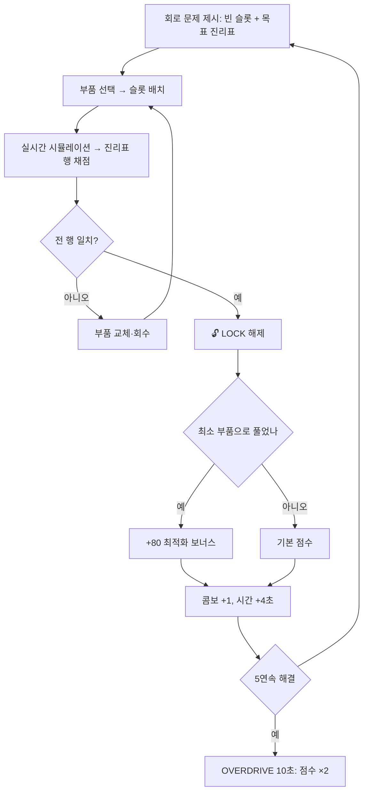

# 🔌 아울 로직 (OWL LOGIC) — 게임 기획 & 설계서 v1

> 아울게임즈 게임 ②. **기존 「나이트 타이퍼」 폐기 후 대체.**
> 상위 문서 `OWLGAMES_SPEC.md` (+ `OWLGAMES_SPEC_PATCH_v2.md` 적용 필수).
> DB `game_id` = **`logic`**. 표시명 **아울 로직**.

---

## 0. 왜 블록코딩 미로가 아니라 논리 회로인가

| 후보 | 기각 사유 |
|---|---|
| 블록코딩으로 부엉이 이동 | **OWL COMPILE(OT용 게임)과 정면 중복.** 같은 동아리가 비슷한 걸 두 개 만들 이유가 없음 |
| 버그 찾기 (코드 스니펫에서 틀린 줄 고르기) | 피싱 헌터와 **구조가 동일**(판별형). 세 게임 중 두 개가 같은 손맛이 됨 |
| 출력 예측 퀴즈 ("이 코드의 결과는?") | 그냥 시험. 부스에서 재미 없음. 문제 소진도 빠름 |
| **논리 회로 조립** ✅ | 손으로 조립하는 손맛 + 정답이 명확 + **절차적 생성으로 문제 무한** + 전공(디지털논리) 연결 |

**핵심 차별점:** 세 게임의 손맛이 확실히 갈린다 → ① 반사·빌드 ② **사고·조립** ③ 판별·지식

---

## 1. 개요

| 항목 | 값 |
|---|---|
| 장르 | 논리 회로 조립 퍼즐 러시 |
| 한 줄 | **"게이트를 끼워 인증 회로를 복구하라. 부품은 모자라게 준다."** |
| 기본 제한시간 | 70초 (문제 해결 시 시간 추가) |
| 목표 플레이 타임 | 평균 70~100초 / 상한 180초 |
| 테마 | 잠긴 서버 도어의 인증 회로 복구. 클리어할 때마다 문이 하나씩 열림 |

---

## 2. 화면 / 조작

```
┌──────────────────────────────────────┐
│ ⏱ 41.2   LOCK 7   콤보 ×1.6         │
├──────────────────────────────────────┤
│  입력          회로 슬롯       출력   │
│  A ●──┐      ┌────┐ ┌────┐          │
│  B ●──┼─────▶│ ?  │▶│ ?  │────▶ 🔒  │
│  C ●──┘      └────┘ └────┘          │
│                                      │
│  목표 진리표                          │
│  A B → OUT                           │
│  0 0 → 0                             │
│  0 1 → 1                             │
│  1 0 → 1                             │
│  1 1 → 0                             │
├──────────────────────────────────────┤
│ 부품:  [AND] [OR] [NOT] [XOR] ×2     │
│        [ 힌트 -8초 ]  [ 제출 ]        │
└──────────────────────────────────────┘
```

| 플랫폼 | 배치 | 제거 | 제출 |
|---|---|---|---|
| 모바일 | **부품 탭 → 슬롯 탭** (드래그 금지 — 작은 화면에서 오조작 다발) | 슬롯 롱탭 | 제출 버튼 (또는 정답 시 **자동 제출** 옵션) |
| PC | 클릭-클릭 또는 드래그 | 우클릭 | `Enter` |

- 배치할 때마다 **즉시 회로가 시뮬레이션**되어 출력 램프가 켜지고, 진리표에서 맞은 행이 초록으로 채워진다 → 제출 전에 스스로 검증 가능. 이 실시간 피드백이 이 게임 재미의 80%.
- 기본은 **자동 제출 ON**: 진리표 전 행이 맞는 순간 자동 클리어(시간 손실 없음).

---

## 3. 코어 루프



---

## 4. 난이도 티어 (LOCK 단계)

해결한 문제 수에 따라 자동 상승.

| 티어 | LOCK | 입력 | 슬롯 | 사용 가능 게이트 | 예시 목표 |
|---|---|---|---|---|---|
| T1 | 1~3 | 2개 | 1칸 | AND, OR, NOT | "둘 다 1일 때만 열림" |
| T2 | 4~7 | 2개 | 2칸 | + XOR | "정확히 하나만 1일 때" |
| T3 | 8~12 | 3개 | 3칸 | + NAND | "A와 B가 다르고 C가 1" |
| T4 | 13~18 | 3개 | 3~4칸 | + 부품 개수 제한 | NOT 1개만 주고 XOR 만들기 |
| T5 | 19+ | 3~4개 | 4칸 | + **MUX(선택기)** | 2비트 비교기, 반가산기 |

- T4부터는 **필요한 부품을 일부러 모자라게 준다.** "NOT이 하나뿐인데 어떻게 뒤집지?" → 드모르간 법칙을 손으로 깨닫게 만드는 구간.
- T5의 반가산기(합/자리올림 2출력)는 이 게임의 보스에 해당.

---

## 5. 문제 생성 — 절차적 + 검증 (암기 방지)

고정 문제 배열 금지. **생성 → 자동 풀이 검증** 파이프라인으로 만든다.

```ts
// 1) 정답 회로를 먼저 랜덤 생성
//    - 입력 n(2~4), 게이트 k(1~4)를 티어에 맞게 뽑고 DAG 구성
// 2) 그 회로를 전체 입력 조합(2^n ≤ 16)으로 평가 → 목표 진리표 산출
// 3) 브루트포스 솔버로 "주어진 부품으로 만들 수 있는 최소 게이트 수" 계산
//    - 부품 수가 적으므로 전수 탐색이 밀리초 단위로 끝남
// 4) 검증 통과 조건:
//    - 해가 존재한다
//    - 해가 티어 난이도에 맞는다 (최소 게이트 수 == 슬롯 수 ± 0)
//    - 진리표가 자명하지 않다 (전부 0 / 전부 1 / 입력 하나와 동일 → 폐기)
//    - 최근 10문제와 진리표 해시가 겹치지 않는다
```

```ts
type Puzzle = {
  id: string; tier: 1|2|3|4|5;
  inputs: string[];                 // ['A','B','C']
  slots: number;                    // 배치 가능 칸
  wiring: Wire[];                   // 슬롯 간 연결은 고정(플레이어는 게이트 종류만 결정)
  parts: Partial<Record<Gate, number>>;  // 지급 부품과 개수
  truth: number[];                  // 목표 출력 비트열 (길이 2^n)
  minGates: number;                 // 최적화 보너스 기준
  hint: string;                     // "출력이 다를 때만 1 → XOR을 떠올려라"
};
```

> **설계 포인트:** 플레이어는 **배선이 아니라 게이트 종류만** 결정한다. 자유 배선은 모바일에서 조작이 지옥이고, 채점도 모호해진다. 배선 고정 + 게이트 선택이면 난이도는 유지되면서 조작이 탭 2번으로 끝난다.

---

## 6. 시간 / 콤보 / 오버드라이브

| 이벤트 | 시간 변화 |
|---|---|
| 시작 | 70초 |
| 문제 해결 | **+4초** (T3 이상은 +6초) |
| 최적화 보너스 달성 | **+2초** 추가 |
| 힌트 사용 | **-8초** |
| 오답 제출(자동 제출 OFF일 때만) | **-3초** |
| 상한 | 누적 180초 |

- **콤보:** 해결마다 +1, 힌트 사용 시 0. 배율 `1 + floor(combo/4) × 0.2`, 최대 **2.4**
- **OVERDRIVE:** 5연속 해결(힌트 없이) → 10초간 점수 ×2, 화면 사이안 발광. 중첩 시 시간 갱신
- **힌트:** 문제당 1회. 1단계 힌트만 제공(정답 게이트를 찍어주지 않고 "어떤 성질인지"만 알려줌)

---

## 7. 점수 → 포인트 연동 ★

### 7.1 원점수
```
raw = Σ(solved × 120 × 콤보배율 × 티어계수)
    + optimal_solves × 80
    + tier_max_reached × 200
    + time_left × 10
    - hints_used × 60
```
- 티어계수: T1 1.0 / T2 1.2 / T3 1.5 / T4 1.9 / T5 2.4
- OVERDRIVE 중 해결은 ×2 (중첩 곱)

### 7.2 플랫폼 환산
`points = 30 + min(270, floor(raw / K))`, **`K_logic = 20`** (3게임 통일)

| 수준 | 내용 | raw | 획득 |
|---|---|---|---|
| 첫 판 | 70초, 6문제 (T1~T2) | ~950 | **77P** |
| 익숙 | 110초, 14문제 (T3), 최적화 5 | ~3,300 | **195P** |
| 숙련 | 180초, 28문제 (T5 도달), 힌트 0 | 9,000+ | **300P (상한)** |

### 7.3 서버 검증 meta
```jsonc
{ "duration_s": 112.4, "solved": 14, "optimal": 5, "tier_max": 3,
  "combo_max": 9, "hints": 1, "wrong_submits": 2,
  "avg_solve_ms": 6200, "time_left": 3.1, "device":"mobile", "v":"1.0.0" }
```
**거부 조건**
- `duration_s` < 10 또는 > 185
- `solved / duration_s` > **0.6** (문제당 최소 1.6초 — 읽고 배치하는 물리적 하한)
- `avg_solve_ms` < **1200**
- `optimal` > `solved`, `tier_max` 가 `solved`로 도달 불가능한 값
- 메타 재계산 raw와 ±5% 초과 불일치 → **서버 재계산값 채택**
- 정답률 100% + `avg_solve_ms` < 2000 → `rejected` + admin 로그

---

## 8. 결과 화면

```
━━━━━━━━━━━━━━━━━━━━
       🔌 아울 로직
    LOCK 14 / TIER 3 돌파
━━━━━━━━━━━━━━━━━━━━
 점수        3,310
 해결        14문제
 최적화      5회 (최소 부품)
 최고 콤보   9
 힌트        1회
 평균 풀이   6.2초
━━━━━━━━━━━━━━━━━━━━
 획득 포인트  +195 P
 Lv.29 ████░░░░░░ Lv.30
━━━━━━━━━━━━━━━━━━━━
 💡 가장 오래 걸린 문제
    "NOT 1개로 XOR 만들기"  24초
    → 드모르간: A⊕B = (A+B)·(A·B)'
━━━━━━━━━━━━━━━━━━━━
 [ 다시하기 ]  [ 랭킹 ]  [ 로비 ]
```
- 가장 오래 걸린 문제에 **한 줄 해설**을 붙여 학습으로 마무리 (피싱 헌터의 오답 다시보기와 같은 역할)
- 랭킹 탭에 **최고 TIER / 최다 해결** 별도 집계

---

## 9. 튜닝 상수

```ts
// /games/logic/config.ts
export const CFG = {
  time:{ base:70, solveT1:4, solveT3:6, optimalBonus:2, hint:-8, wrong:-3, max:180 },
  combo:{ step:4, stepMult:0.2, maxMult:2.4 },
  overdrive:{ triggerStreak:5, durationSec:10, mult:2 },
  tier:{ thresholds:[0,4,8,13,19], mult:[1.0,1.2,1.5,1.9,2.4] },
  score:{ perSolve:120, optimal:80, tierReach:200, timeLeft:10, hintPenalty:60 },
  gen:{ maxInputs:4, maxSlots:4, recentTruthBlock:10, solverTimeoutMs:50 },
  ui:{ autoSubmit:true, tapToPlace:true },
  platform:{ K:20, basePoints:30, maxBonus:270, maxSessionSec:185 },
} as const;
```

---

## 10. 구현 구조

```
games/logic/
├─ index.tsx
├─ config.ts
├─ engine/
│  ├─ gates.ts        # AND/OR/NOT/XOR/NAND/MUX 평가 함수
│  ├─ circuit.ts      # 슬롯 그래프 평가 (순수 함수, 단위 테스트 필수)
│  ├─ generator.ts    # §5 생성 + 검증
│  ├─ solver.ts       # 브루트포스 최소 게이트 탐색
│  ├─ judge.ts        # 진리표 비교, 최적화 판정
│  └─ score.ts
└─ ui/
   ├─ CircuitBoard.tsx   # SVG 렌더 (선·노드 표현에 SVG가 최적)
   ├─ TruthTable.tsx     # 행별 실시간 채점 표시
   └─ PartTray.tsx
```
- **렌더는 SVG**. 배선·노드·신호 흐름 애니메이션(전류가 흐르는 점선)은 SVG가 캔버스보다 압도적으로 쉽다.
- 신호가 1인 배선은 **앰버로 발광 + 점 흐름 애니메이션** → 회로가 살아있다는 느낌이 곧 피드백.
- `circuit.ts` / `solver.ts` 는 순수 함수로 짜고 **단위 테스트 필수** (여기서 틀리면 게임 전체가 무너짐).

---

## 11. 수용 기준

| # | 기준 |
|---|---|
| 1 | 생성기 1만 회: 해가 없는 문제 **0건**, 자명한 진리표 0건, 최근 10문제 진리표 중복 0건 |
| 2 | 솔버가 모든 문제를 **50ms 이내** 판정 |
| 3 | 부품 배치 즉시(1프레임 내) 진리표 채점이 갱신됨 |
| 4 | 모바일에서 드래그 없이 탭 2번으로 배치 완료 |
| 5 | 자동 제출 ON일 때 정답 완성 순간 즉시 클리어 |
| 6 | `circuit.ts` 단위 테스트: 6종 게이트 × 전체 입력 조합 |
| 7 | 봇 시뮬 1,000판: 평균 70~110초, raw 중앙값 2,500~3,500 |
| 8 | 조작된 meta(`avg_solve_ms` 500 등) 100% 거부 |

---

## 12. 접근성 / 부스 운영

- 신호 표현은 색(앰버/회색)뿐 아니라 **실선/점선 + 0·1 숫자 라벨** 병기
- 게이트는 기호 + **텍스트 라벨(AND, XOR)** 동시 표기 — 기호만으론 비전공자가 못 읽음
- 글자 크기 2단계 토글
- 부스 팁: 전공 수업(디지털논리)을 들은 학생이 강한 게임 → **"전공자 자존심 게임"**으로 홍보하면 반응이 좋음. 랭킹 탭 분리 권장

---

## 13. 추가 제안

| 기능 | 설명 | 우선순위 |
|---|---|---|
| **일일 시드** | 전원 동일 문제 세트 → 공정 랭킹 | 높음 |
| **연습 모드** | 포인트 없이 T1~T2 무한, 대기줄에서 연습 | 중간 |
| **회로 도감** | 해결한 회로(반가산기 등)를 `/me`에 수집 | 중간 |
| **2인 대결** | 같은 문제 동시 풀이, 먼저 푸는 쪽 승 | 낮음 |
