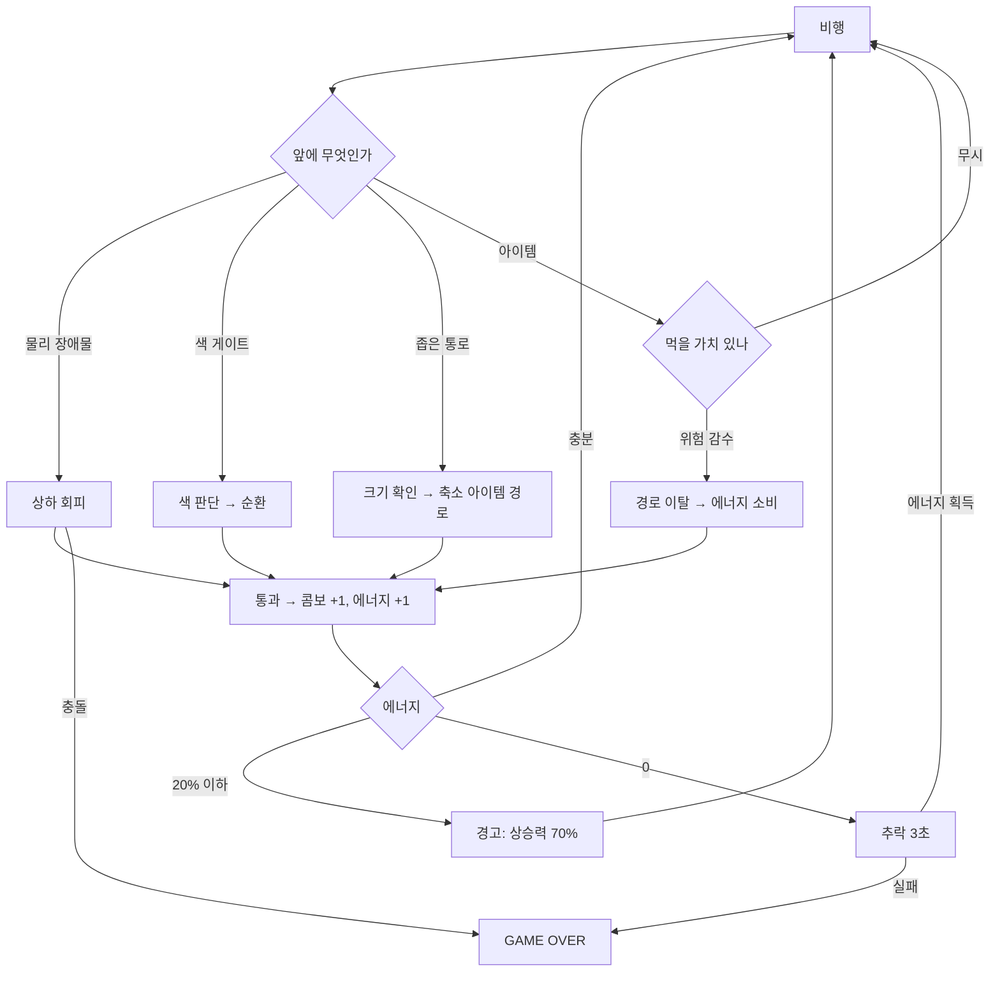
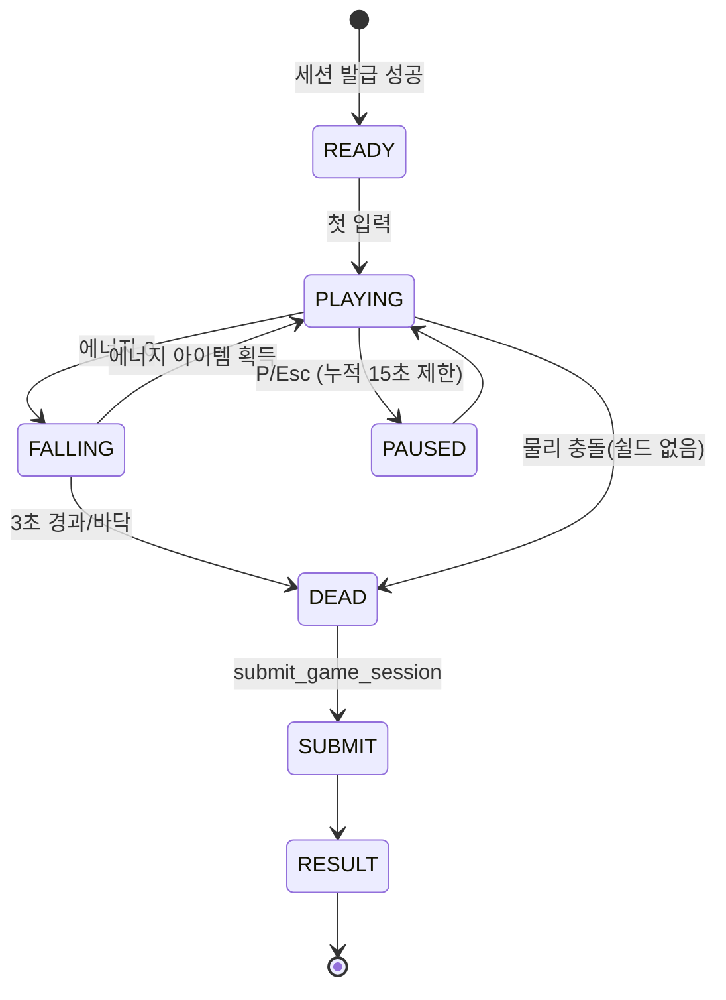

# 🦉 아울러닝 (OWL RUNNING) — 게임 기획 & 설계서 v2

> 아울게임즈 게임 ①. `OWLGAMES_SPEC.md`의 하위 문서이며, 플랫폼 규칙(포인트·레벨·세션 검증)은 상위 문서를 따른다.
> DB `game_id` enum 값은 **`flight`** 그대로 유지하고, 표시명만 **아울러닝**으로 쓴다. (마이그레이션 변경 불필요)

---

## 0. v1(초안) 대비 변경 사항 — 왜 바꿨는지

| # | 초안 | v2 변경 | 이유 |
|---|---|---|---|
| 1 | 색상·크기·에너지 3종 시스템을 처음부터 전부 노출 | **거리 기반 페이즈 해금** (0~200m 회피만 → 색상 → 크기 → 이동장애물) | 부스 행사는 1판 60~90초, 설명 없이 바로 플레이해야 함. 첫 20초에 3개 시스템을 동시에 던지면 대부분 5초 만에 죽고 이탈함 |
| 2 | 에너지가 **시간당 자동 감소** | **날갯짓(상승 입력) 중에만 소비**, 활공은 0 | 자동 감소는 그냥 "죽는 타이머"라 플레이어가 개입할 여지가 없음. 입력과 연결해야 "지금 올라갈까 말까"라는 판단이 생기고, 회복 아이템에 의미가 붙음 |
| 3 | 색 불일치 = 충돌(즉사) | **색 게이트 = 에너지 -25 + 감속 (즉사 아님)** / 물리 장애물 = 즉사 | 즉사 2종류를 동시에 두면 억울함이 큼. "색 실수는 손해, 벽은 죽음"으로 분리하면 난이도는 유지되면서 체감 공정성이 올라감 |
| 4 | 색상 변경 쿨타임 1초 | **0.2초 + 에너지 -2** | 후반 연속 색상 구간과 1초 쿨타임은 구조적으로 충돌함. 연타 억제는 에너지 비용으로 처리 |
| 5 | 색상 = 색으로만 구분 | **색 + 도형 병기** (● ■ ▲) | 색각 이상 비율이 남성 약 8%. 부스에서 "안 보여요" 나오면 게임이 망함. 필수 |
| 6 | 보호 깃털(무적) + 무지개 깃털(전색 통과) | 역할 분리: **쉴드 = 물리 충돌 1회 방어**, **무지개 = 색 판정 무시 5초** | 둘 다 "무적"이면 플레이어가 차이를 인지 못 함 |
| 7 | 장애물 랜덤 생성 | **청크(패턴 프리팹) 기반 생성** | 순수 랜덤은 통과 불가능한 배치가 반드시 나옴. 청크로 짜야 품질 보장 + 구현이 오히려 쉬움 |
| 8 | 포인트 연동이 "누적된다" 수준 | **원점수 공식 + 환산 계수 + 서버 검증 상한 명시** (§11) | Claude Code가 바로 구현 가능해야 함 |
| 9 | NIGHT FLIGHT = 안 보임 | 배경만 어둡고 **장애물은 윤곽 발광** | "안 보여서 죽음"은 난이도가 아니라 불쾌함 |
| 10 | 게임오버 = 그 자리에서 끝 | 에너지 0 → **추락 상태 3초**, 그 안에 에너지 아이템 먹으면 복귀 | 마지막 반전 여지 = 부스에서 옆 사람이 구경하는 재미 |

---

## 1. 개요

| 항목 | 값 |
|---|---|
| 장르 | 2D 횡스크롤 무한 비행 러너 + 색상 매칭 |
| 한 줄 | **"색을 맞추고, 몸집을 고르고, 날갯짓을 아끼며 더 멀리"** |
| 목표 플레이 타임 | 평균 60~90초 / 숙련자 상한 180초 (서버 세션 상한과 동일) |
| 플랫폼 | 웹 (모바일 우선, PC 병행), Canvas 2D |
| 논리 해상도 | 960 × 540 (16:9), CSS로 스케일. 1m = 24px |
| 목표 프레임 | 60fps (저사양 기기에서 파티클 자동 감소) |

**설계 원칙 3가지**
1. **첫 10초는 무조건 안 죽는다.** 튜토리얼 없이 손가락으로 배우게 한다.
2. **모든 시스템은 하나의 자원(에너지)으로 수렴한다.** 색·크기·아이템·니어미스가 전부 에너지 수지에 영향을 준다.
3. **죽는 이유가 항상 명확해야 한다.** 화면에 원인(벽 충돌/에너지 고갈)을 1초간 표시.

---

## 2. 조작

### 모바일 (기본 타깃)
| 입력 | 기능 |
|---|---|
| 화면 **왼쪽 절반** 터치 홀드 | 날갯짓(상승). 떼면 활공/하강 |
| 화면 **오른쪽 하단 대형 버튼** 탭 | 색상 순환 (R → B → P → R). 버튼에 현재 색+도형 표시 |
| 오른쪽 버튼 **길게 누르기** | 색상 3개 부채꼴로 펼쳐 직접 선택 (숙련자용, 선택 구현 P2) |

> 양손 엄지 전제. 버튼 최소 72px. 세로 화면이면 "가로로 돌려주세요" 오버레이.

### PC
| 키 | 기능 |
|---|---|
| `Space` / 마우스 좌클릭 홀드 | 상승 |
| `Shift` | 색상 순환 |
| `1` `2` `3` | 색상 직접 선택 (RED / BLUE / PURPLE) |
| `P` / `Esc` | 일시정지 (부스 운영상 **총 15초까지만** 허용, 이후 자동 재개) |

### 물리 상수 (튜닝값 §13)
```
GRAVITY            = 1800 px/s²
FLAP_ACCEL         = -2600 px/s²   (홀드 중 가산 → 합력 -800)
VY_MAX_DOWN        = 900 px/s
VY_MAX_UP          = -700 px/s
OWL_X              = 220 px (고정)
SCROLL_V0          = 288 px/s (12 m/s)
SCROLL_V_MAX       = 576 px/s (24 m/s)
SCROLL_ACCEL       = +96 px/s per 60s (선형, 특수구간 배율 별도)
```
천장·바닥은 **즉사 아님** — 닿으면 에너지 -10 + 튕김(초보 보호).

---

## 3. 코어 루프



### 페이즈 해금 (거리 기준)
| 페이즈 | 거리 | 신규 요소 | 힌트 배너(3초) |
|---|---|---|---|
| P0 | 0~200m | 기둥·전깃줄만. **에너지 소비 50%**, 간격 넓음 | "꾹 눌러 상승" |
| P1 | 200~500m | 색 게이트(단색), 게이트 2초 전 예고선 | "색을 맞춰 통과" |
| P2 | 500~900m | 크기 아이템, 좁은 통로, ⭐포인트 | "작아지면 좁은 길로" |
| P3 | 900~1500m | 이동 장애물, 연속 색 게이트, 에너지 소비 100% | "에너지를 아껴라" |
| P4 | 1500m+ | 전 요소 + 특수 구간 순환, 속도 상한까지 상승 | — |

---

## 4. 색상 시스템 (메인 기믹)

- 색상 3종. **반드시 도형과 함께** 표기한다.

| 색 | HEX | 도형 | 키 |
|---|---|---|---|
| RED | `#FF4D4D` | ● 원 | 1 |
| BLUE | `#3DD9EB` | ■ 사각 | 2 |
| PURPLE | `#A855F7` | ▲ 삼각 | 3 |

- 부엉이 본체는 현재 색으로 발광하고, 꼬리에 같은 도형 아이콘이 붙는다.
- 게이트는 **색 면 + 큰 도형 실루엣**. 게이트 접근 2초 전 화면 우측 가장자리에 다음 필요 색 예고 칩 표시(P3까지. P4는 예고 1초로 단축).
- **판정:** 게이트 통과 순간의 색만 본다. 통과 중 변경 허용(관대하게).
- **불일치 시:** 에너지 -25, 스크롤 0.5초간 60% 감속, 콤보 0, 0.6초 무적, 화면 붉은 플래시. **죽지 않는다.**
- 순환 쿨타임 0.2s, 1회당 에너지 -2.

### 게이트 패턴 난이도
| 등급 | 형태 | 등장 |
|---|---|---|
| G1 | 단색 게이트 1개 | P1+ |
| G2 | 상하 2분할, 색이 다름 → 색+위치 동시 선택 | P2+ |
| G3 | 3연속 다른 색 (R→P→B) | P3+ |
| G4 | 이동하는 게이트 + 연속 색 | P4+ |
| G5 | 색 반전 트랩 (예고와 실제가 1회 다름, 0.5초 전 깜빡임으로 경고) | P4+, 저빈도 |

---

## 5. 에너지 시스템 (FLIGHT ENERGY)

**핵심: 에너지는 "시간"이 아니라 "날갯짓"의 비용이다.**

| 항목 | 값 |
|---|---|
| 최대치 | S 80 / M 100 / L 130 (크기 연동) |
| 시작값 | 최대치의 80% |
| 날갯짓 홀드 | **-14 / 초** (P0는 -7) |
| 활공(입력 없음) | 0 |
| 색상 변경 | -2 |
| 장애물·게이트 통과 | **+1** |
| NEAR MISS | **+2** |
| 색 불일치 | -25 |
| 천장·바닥 접촉 | -10 |
| 🪶 깃털 에너지 | +20 |
| ⭐ 대형 에너지 | +50 |
| ⚡ 효율 버프 | 8초간 소비 50% |

- **20% 이하:** 화면 가장자리 붉은 비네트 + 경고음, 상승 가속 70%로 감소.
- **0:** `FALLING` 상태 진입. 상승 불가, 3초 카운트. 이 안에 에너지 아이템을 먹으면 **+30으로 복귀**(연출: 깃털 폭발). 못 먹으면 게임오버.
- 설계 의도: 잘 타면 통과 보너스(+1)와 니어미스(+2)로 **소비를 상쇄**할 수 있다. 즉 잘하는 사람은 에너지가 안 떨어지고, 허둥대는 사람만 고갈된다 → 실력 표현이 자연스럽게 됨.

---

## 6. 크기 시스템

| 단계 | 배율 | 최대 에너지 | 히트박스 | 자석 반경 | 특징 |
|---|---|---|---|---|---|
| S (소형) | 0.7 | 80 | 작음 | 40px | 좁은 통로 전용 구간 통과 가능 |
| M (기본) | 1.0 | 100 | 보통 | 60px | 시작 상태 |
| L (대형) | 1.35 | 130 | 큼 | 90px | 아이템 흡수 범위 넓음, 천장/바닥 여유 적음 |

- 변경은 **아이템으로만**. 🟢성장 = 한 단계 ↑, 🔵축소 = 한 단계 ↓.
- 변경 시 0.4초 스케일 트윈 + **0.3초 무적**(끼임 방지).
- 히트박스는 스프라이트의 **70% 크기 타원** (러너 장르 관용 — 아슬아슬하게 살았다는 느낌을 주려고 일부러 작게).
- 특정 구간은 **S 전용 통로 / L 전용 파괴 벽**(L이면 부수고 통과, +100점)으로 설계해 두 방향 다 가치를 갖게 한다.

---

## 7. 아이템

| 아이템 | 효과 | 점수 | 등장 페이즈 | 가중치 |
|---|---|---|---|---|
| 🪶 깃털 에너지 | 에너지 +20 | +10 | P0+ | 40 |
| ⭐ 대형 에너지 | 에너지 +50 | +30 | P1+ | 8 |
| 🟢 성장 깃털 | 크기 +1단계 | +20 | P2+ | 10 |
| 🔵 축소 깃털 | 크기 -1단계 | +20 | P2+ | 10 |
| 🛡️ 보호 깃털 | **물리 충돌 1회 방어**(쉴드 아이콘 유지) | +40 | P2+ | 6 |
| ⚡ 에너지 효율 | 8초간 소비 50% | +30 | P3+ | 6 |
| 🌈 무지개 깃털 | **5초간 색 판정 무시** (전 게이트 통과) | +60 | P3+ | 4 |
| 💎 보너스 젬 | 점수 +150 | +150 | P2+, 위험 위치 고정 | 6 |
| 🎯 포인트 별 | 점수 +50 | +50 | P1+ | 20 |

**배치 규칙:** 회복 계열은 **안전 경로에서 벗어난 위치**에 둔다(초안 §12 의도 유지). 💎은 반드시 위험 위치(장애물 틈새, 천장 근접).
**중복 규칙:** 🌈과 🛡️은 동시 보유 가능, 같은 버프 재획득 시 지속시간 갱신(합산 아님).

---

## 8. 레벨 생성 — 청크 시스템

랜덤 좌표 생성 금지. **청크 프리팹 풀에서 이어 붙인다.**

```ts
// /games/flight/chunks/types.ts
type Chunk = {
  id: string;
  width: number;              // px (보통 720~1440)
  phase: 0 | 1 | 2 | 3 | 4;   // 최소 등장 페이즈
  difficulty: 1 | 2 | 3 | 4 | 5;
  tags: ('gate'|'narrow'|'moving'|'item'|'breather')[];
  entities: Entity[];         // x는 청크 로컬 좌표
};

type Entity =
  | { t:'pillar';  x:number; gapY:number; gapH:number }          // 상하 기둥 쌍
  | { t:'wire';    x:number; y:number; w:number }                // 수평 전깃줄
  | { t:'gate';    x:number; y:number; h:number; color:Color }   // 색 게이트
  | { t:'narrow';  x:number; y:number; h:number; w:number; size:'S' } // S 전용 통로
  | { t:'wall';    x:number; y:number; h:number; breakBy:'L' }   // L 전용 파괴 벽
  | { t:'bug';     x:number; y0:number; y1:number; period:number } // 상하 이동 몬스터
  | { t:'item';    x:number; y:number; kind:ItemKind };
```

**생성 규칙**
1. 현재 페이즈 이하의 청크 중 `difficulty ≤ 현재 난이도 상한`인 것만 후보.
2. 직전 2개 청크 id 재사용 금지.
3. 난이도 3 이상 청크 2개 연속 뒤에는 **반드시 `breather` 태그 청크 1개** (숨 돌리는 구간 = 체감 난이도 조절의 핵심).
4. 청크 이음새는 통로 y가 이전 끝 y와 ±120px 이내여야 함 (물리적으로 도달 가능 보장).
5. 필요 청크 수: **페이즈당 최소 8개**, 총 40개 이상. Claude Code가 JSON으로 생성하고, 자동 검증 스크립트(§16)로 통과 가능성 확인.

---

## 9. 난이도 곡선

| 거리 | 스크롤 속도 | 통로 폭 | 게이트 빈도 | 에너지 소비 |
|---|---|---|---|---|
| 0~200m | 288 px/s | 260px | — | 50% |
| 200~500m | 312 | 240px | 낮음 | 70% |
| 500~900m | 360 | 220px | 보통 | 100% |
| 900~1500m | 432 | 195px | 높음 | 100% |
| 1500~2500m | 504 | 180px | 높음 + 이동 | 110% |
| 2500m+ | 576 (상한) | 170px | 최대 | 110% |

---

## 10. 특수 구간

1500m 이후 **400m마다 35% 확률**로 발동, 길이 300m. 진입 시 화면 배너 + 배경 전환.

| 구간 | 내용 | 보너스 |
|---|---|---|
| 🌈 COLOR RUSH | 게이트만 연속 등장, 물리 장애물 없음 | 게이트 점수 ×2 |
| 🪶 FEATHER STORM | 아이템 다량 + 통로 좁음 | 아이템 점수 ×1.5 |
| ⚡ TURBO FLIGHT | 속도 ×1.4, 장애물 단순화 | 거리 점수 ×2 |
| 🌙 NIGHT FLIGHT | 배경 암전, **장애물은 윤곽 발광(도형 유지)** | NEAR MISS ×2 |

완주 시 **+200점**. 구간 중에는 난이도 상승을 일시 정지(이중 압박 방지).

---

## 11. 점수 → 포인트 연동 ★ (플랫폼 연결부)

### 11.1 인게임 원점수 (`raw_score`)
```
raw =  distance_m × 1
     + pass_count × 10 × combo_mult_avg
     + near_miss × 25 × combo_mult_avg
     + item_score_sum
     + special_clear × 200
     + energy_left × 2          // 종료 시 남은 에너지
```
- `combo_mult = 1 + floor(combo / 10) × 0.25` (최대 **2.5**)
- 콤보는 통과(장애물·게이트)마다 +1, **피격(색 불일치·천장바닥·추락 진입) 시 0**

### 11.2 플랫폼 포인트 환산
상위 스펙 공식 그대로: `points = 30 + min(270, floor(raw / K))`, **`K_flight = 20`** (기존 3 → **20으로 변경**. `app_config.game_k` 업데이트 필요)

| 플레이어 | 예상 | raw | 획득 P |
|---|---|---|---|
| 첫 판 (30초, 350m) | 거의 못 감 | ~600 | **60P** |
| 익숙해짐 (90초, 1,300m) | 콤보 20, 니어미스 15 | ~3,000 | **180P** |
| 숙련 (180초, 3,500m) | 특수구간 2회 | ~9,000+ | **300P (상한)** |

> 상한 300P는 어뷰징 방지 장치이기도 하다. 숙련자는 1판 180초에 300P, 초보는 30초에 60P → **시간당 효율이 6배 차이가 나지 않게** 설계됨(숙련 6,000P/h vs 초보 7,200P/h). 초보가 억울하지 않고, 고수는 "빨리 죽고 다시 돌리기"가 이득이 아님.

### 11.3 서버 검증 (`submit_game_session` meta)
```jsonc
{
  "distance_m": 1284, "duration_s": 92.4, "pass_count": 61,
  "near_miss": 14, "combo_max": 27, "items": 23,
  "energy_left": 38, "phase_max": 3, "special_cleared": 1,
  "size_end": "M", "build": "1.0.3"
}
```
거부(`rejected`) 조건:
- `duration_s` < 3 또는 > 185
- `distance_m` > `24 × duration_s × 1.02` (물리적 최대 속도 초과)
- `pass_count` > `distance_m / 8` (8m마다 1개 이상은 불가능)
- `near_miss` > `pass_count`
- `raw_score`가 위 메타로 재계산한 값과 ±5% 초과 불일치 → **서버가 메타로 재계산한 값을 채택**
- 동일 유저 직전 제출과 간격 < 3초

---

## 12. 게임오버 & 결과

**종료 조건:** ① 물리 장애물 충돌(쉴드 없을 때) ② 추락 3초 실패
**사망 연출:** 0.4초 슬로우 + 원인 표시 (`💥 벽 충돌` / `🪫 에너지 고갈`)

```
━━━━━━━━━━━━━━━━━━━━
        🦉 아울러닝
━━━━━━━━━━━━━━━━━━━━
 거리        1,284 m
 점수        3,042
 최고 콤보   27
 NEAR MISS   14
 아이템      23개
 도달 페이즈 P3
━━━━━━━━━━━━━━━━━━━━
 획득 포인트  +182 P
 Lv.34 ██████░░░░ Lv.35
 🏅 골드 → (다음 랭크까지 420P)
━━━━━━━━━━━━━━━━━━━━
 내 최고기록까지  152m
 [ 다시하기 ]  [ 랭킹 ]  [ 로비 ]
```
- 신기록이면 `🎉 NEW RECORD` 풀스크린 연출
- 랭크업이 발생하면 **플랫폼의 `LevelUpOverlay` → 티켓 획득 연출**로 이어짐 (§22 연동)
- `[다시하기]`는 결과 화면에서 1탭 (로비 경유 금지 — 부스 회전율)

---

## 13. 튜닝 상수 (한 파일에 모을 것)

`/games/flight/config.ts` 에 전부 상수로 두고, 매직넘버 금지.
```ts
export const CFG = {
  physics:{ gravity:1800, flap:-2600, vyMaxDown:900, vyMaxUp:-700, owlX:220, pxPerMeter:24 },
  scroll:{ v0:288, vMax:576, accelPer60s:96 },
  energy:{ maxBySize:{S:80,M:100,L:130}, startRatio:0.8, flapDrain:14, colorCost:2,
           passGain:1, nearGain:2, gateFail:25, edgeHit:10, lowRatio:0.2,
           lowFlapMult:0.7, fallGraceSec:3, reviveTo:30 },
  size:{ scale:{S:0.7,M:1.0,L:1.35}, hitboxRatio:0.7, magnet:{S:40,M:60,L:90}, changeIFrame:0.3 },
  color:{ cycleCooldown:0.2, failSlow:0.6, failSlowSec:0.5, iFrame:0.6, previewSec:2 },
  score:{ perMeter:1, perPass:10, nearMiss:25, nearMissMarginPx:12,
          comboStep:10, comboStepMult:0.25, comboMaxMult:2.5, specialClear:200, energyLeft:2 },
  platform:{ K:20, basePoints:30, maxBonus:270, maxSessionSec:185 },
} as const;
```

---

## 14. 구현 구조

```
games/flight/
├─ index.tsx            # React 래퍼: 캔버스, HUD, 결과 모달, 세션 RPC
├─ config.ts            # §13
├─ engine/
│  ├─ loop.ts           # fixed timestep 1/60 + accumulator, rAF
│  ├─ owl.ts            # 물리, 크기, 색, 히트박스
│  ├─ energy.ts
│  ├─ spawner.ts        # 청크 선택·이어붙이기·오브젝트 풀
│  ├─ collision.ts      # 타원-사각 판정, near-miss 판정
│  ├─ score.ts          # 콤보·점수·meta 집계
│  ├─ phases.ts         # 페이즈·난이도·특수구간
│  └─ render.ts         # 레이어: 배경 → 장애물 → 아이템 → 부엉이 → 파티클 → HUD
├─ chunks/*.json
└─ hud/                 # 에너지바, 콤보, 색 버튼, 힌트 배너
```

**엔진 규칙**
- 고정 타임스텝 `1/60`, 누적자 방식. 탭 전환 복귀 시 `dt` 클램프(최대 0.25s) → 순간이동 방지.
- 엔티티 **오브젝트 풀링**(기둥 32, 아이템 64, 파티클 128). GC 스파이크 금지.
- 화면 밖(x < -200) 엔티티 즉시 반환.
- 렌더와 로직 분리. 로직은 순수 함수 위주로 짜서 테스트 가능하게.
- 일시정지/블러 시 자동 pause, `visibilitychange` 핸들링.



---

## 15. HUD

- 좌상단: `FLIGHT ENERGY` 바 (색: 초록→노랑→빨강, 20% 이하 맥동)
- 우상단: 거리 `1,284m` / 점수
- 중앙 상단: 콤보 (10 단위로 확대 연출)
- 우하단: 색상 버튼(현재 색+도형), 그 위 다음 필요 색 예고 칩
- 좌하단: 크기 아이콘(S/M/L), 활성 버프 아이콘 + 남은 시간 링
- HUD는 **화면 면적 18% 이하**. 플레이 영역 침범 금지.

---

## 16. 수용 기준 (Claude Code 체크리스트)

| # | 기준 |
|---|---|
| 1 | 아이폰 SE(375px) 가로 모드에서 60fps 유지, 터치 응답 지연 50ms 이하 |
| 2 | **청크 검증 스크립트** `npm run verify:chunks` — 모든 청크에 대해 물리 시뮬로 통과 가능 경로 탐색, 실패 시 빌드 에러 |
| 3 | P0 구간(0~200m)에서 아무 입력도 안 하면 바닥에 닿아도 죽지 않음 |
| 4 | 색 불일치로는 절대 사망하지 않음 (에너지 0 유도만 가능) |
| 5 | 색맹 시뮬레이터(적록/청황)로 게이트 구분 가능 |
| 6 | 1,000판 자동 봇 시뮬레이션: 평균 60~90초, raw 중앙값 2,500~3,500 |
| 7 | 서버 검증 룰이 조작된 meta(거리 2배 등)를 100% 거부 |
| 8 | 결과 → [다시하기] 1탭으로 3초 내 재시작 |
| 9 | `prefers-reduced-motion` 시 화면 흔들림·파티클 비활성 |
| 10 | 사망 원인이 항상 화면에 표시됨 |

---

## 17. 접근성 / 부스 운영

- **색+도형 병기** (필수), 고대비 토글
- 사운드 **기본 음소거** (부스 소음 환경). 아이콘으로 on/off
- 한 손 모드: 색상 순환을 화면 아무 곳 더블탭으로도 가능하게 (설정)
- 부스 태블릿용 **관전 모드**: 플레이 중 화면을 전광판에 미러링(P5, 선택)
- 운영시간 외 진입 시 게임 로드 자체를 막고 안내 (서버 `start_game_session` 거부 처리)

---

## 18. 추가 제안 (여력 되면)

| 기능 | 설명 | 우선순위 |
|---|---|---|
| **오늘의 도전과제 3종** | "니어미스 20회", "1,500m 도달", "무지개 깃털 2개" → 달성 시 보너스 +150P, 부스 체류시간 증가 | 높음 |
| **고스트 라인** | 내 최고기록 위치를 반투명 부엉이로 표시 → 자기 경쟁 | 중간 |
| **일일 시드 모드** | 모두 같은 맵으로 경쟁하는 모드 → 랭킹 공정성 | 중간 |
| **리플레이 3초 GIF** | 사망 직전 3초 저장 → 전광판에 "오늘의 명장면" | 낮음(재미 큼) |
| **동아리 컬러 스킨** | S.OWL 로고 부엉이, 랭크별 깃털 색 | 낮음 |

---

## 19. 미정 (기본값으로 진행)

| 항목 | 기본값 |
|---|---|
| 아트 | 도형 + 이모지 프로토타입. 에셋 교체 가능하게 `sprites.ts`로 분리 |
| BGM/SFX | 무음 기본, SFX만 경량 WebAudio |
| 청크 개수 | 40개로 시작, 플레이 테스트 후 확장 |
| 도전과제 | P5 단계에서 구현 |
