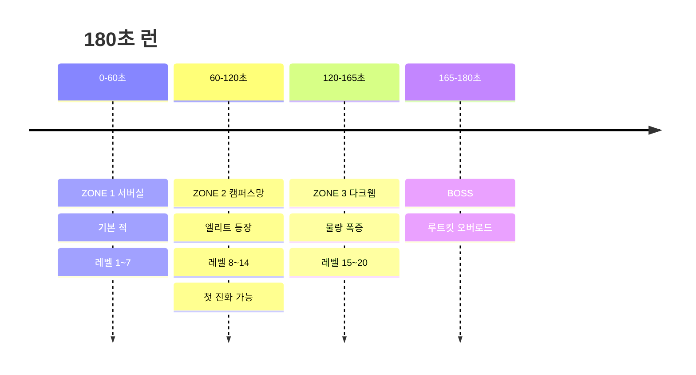
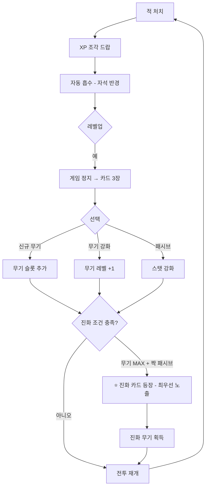

# 🦉 아울 서바이버즈 (OWL SURVIVORS) — 게임 기획 & 설계서 v1

> 아울게임즈 게임 ①. **기존 「아울러닝」 폐기 후 대체.**
> 상위 문서 `OWLGAMES_SPEC.md` (+ `OWLGAMES_SPEC_PATCH_v2.md` 적용 필수).
> DB `game_id` = **`survive`**. 표시명 **아울 서바이버즈**.

---

## 1. 개요

| 항목 | 값 |
|---|---|
| 장르 | 탑다운 오토배틀 로그라이트 (뱀파이어 서바이버즈류) |
| 한 줄 | **"3분 안에 빌드를 완성해서 서버를 지켜라."** |
| 런 길이 | **180초 고정** (생존 시 클리어). 중간 사망 시 그 시점 기록 |
| 조작 | **이동만.** 공격은 전부 자동 |
| 테마 | 부엉이 = 보안 관제 AI / 적 = 악성코드 / 무기 = 보안 도구 |
| 화면 | 논리 해상도 960×540, 고정 카메라 추적 |

### 설계 원칙
1. **조작은 엄지 하나.** 부스에서 설명 없이 3초 만에 이해돼야 한다.
2. **선택이 곧 게임이다.** 레벨업 3선택 → 시너지 → 진화. 매 판 빌드가 달라야 다시 한다.
3. **3분에 기승전결.** 원작의 30분 구조를 1/10로 압축. 마지막 30초에 보스로 클라이맥스.
4. **영구 성장 금지.** (§10 참고 — 부스 행사에서 영구 강화는 후발 참가자를 구조적으로 불리하게 만든다)

---

## 2. 조작

| 플랫폼 | 이동 | 기타 |
|---|---|---|
| 모바일 | 화면 왼쪽 절반 **가상 조이스틱**(터치한 지점이 원점, 반경 60px) | 레벨업 선택 = 카드 탭 |
| PC | `WASD` / 방향키 | 선택 = `1`/`2`/`3` 또는 클릭 |

- 공격·조준·스킬 사용 **전부 자동**. 버튼 없음.
- 일시정지는 레벨업 카드 선택 시 자동 (게임 시간 정지).

---

## 3. 런 구조 — 3분 타임라인



| 구간 | 초 | 동시 적 수 | 신규 |
|---|---|---|---|
| ZONE 1 | 0~60 | 20 → 60 | 버그, 웜 |
| ZONE 2 | 60~120 | 60 → 110 | 트로이목마, **엘리트(30초마다)** |
| ZONE 3 | 120~165 | 110 → 180 | 봇넷 무리, 랜섬웨어 |
| BOSS | 165~180 | 80 + 보스 | **루트킷 오버로드** |

- ZONE 전환 시 화면 톤 전환 + `ZONE 2` 배너 + **구역 클리어 보너스 +150점**
- 보스 처치 시 `SYSTEM SECURED` 연출 + 대량 보너스. 처치 못 해도 180초 도달하면 클리어 판정(보너스는 차등)

---

## 4. 코어 루프



**"처치 → 선택 → 내가 만든 걸로 싸운다"** 이 루프가 게임의 전부다. 나머지는 전부 이 루프를 돋보이게 하는 장치.

---

## 5. 성장 시스템

### 5.1 레벨 / XP
- 레벨 L → L+1 필요 XP: `8 + 6 × L` (Lv20까지 약 1,340 XP)
- 적 1마리 = 1~5 XP (등급별). 엘리트 = 25, 보스 = 100
- 레벨업 시 **카드 3장 중 1장 선택**. 슬롯이 가득 찼으면 보유 무기 강화만 등장
- 슬롯: **무기 4칸 / 패시브 4칸** (원작보다 축소 — 3분 런에 6칸 이상은 다 못 채움)

### 5.2 리롤 / 스킵
- 리롤 1회 (런당), 스킵 시 XP 10% 즉시 획득
- 카드 3장이 전부 별로일 때의 답답함을 없애는 장치. 무료 1회만

---

## 6. 무기 (8종)

| 무기 | 방식 | 초기 성능 | 진화 짝 | 진화체 |
|---|---|---|---|---|
| 🪶 **깃털 표창** (시작무기) | 가장 가까운 적에게 자동 발사 | 1발 / 0.8초 | 램 | **깃털 폭풍** — 8방향 난사 |
| 🛡️ **방화벽** | 주변 원형 장판 지속 피해 | 반경 70px | 방화벽 두께 | **제로 트러스트** — 반경 2배 + 넉백 |
| 📡 **패킷 스니퍼** | 직선 관통 레이저 | 1.4초마다 | 대역폭 | **백본 레이저** — 화면 관통 + 화상 |
| 🛰️ **포트 스캐너** | 주위를 도는 위성 | 위성 2개 | 코어 | **봇넷 오비탈** — 위성 6개 + 흡수 |
| 🍯 **하니팟** | 바닥에 설치, 적 유인 후 폭발 | 3초마다 | 자석 | **허니 클러스터** — 연쇄 폭발 |
| 💉 **백신** | 주기적 체력 회복 + 주변 피해 | 8초마다 | 램 | **자동 면역** — 회복량 2배 + 무적 0.5초 |
| ⚡ **디도스** | 무작위 방향 난사 | 초당 2발 | CPU 클럭 | **볼류메트릭** — 탄막 |
| 🧨 **로그 폭탄** | 일정 킬 수마다 화면 전체 폭발 | 40킬마다 | 코어 | **커널 패닉** — 20킬마다 + 화면 정지 |

### 패시브 (6종)
| 패시브 | 효과 (레벨당) |
|---|---|
| 🧠 코어 | 피해 +12% |
| ⏱️ CPU 클럭 | 쿨다운 -8% |
| 💾 램 | 투사체 +1 (3레벨마다) |
| 📶 대역폭 | 투사체 속도·사거리 +15% |
| 🧱 방화벽 두께 | 최대 체력 +20, 받는 피해 -5% |
| 🧲 자석 | XP 획득 반경 +30% |
| 👟 부츠 | 이동속도 +10% |

**진화 규칙:** 무기 Lv **5(MAX)** + 짝 패시브 **Lv3 이상** → 다음 레벨업에 **⭐진화 카드가 무조건 최상단**에 등장.
진화 카드는 화면 연출을 크게 준다(황금 테두리 + 효과음). 이 순간이 런의 하이라이트.

> 3분 런에서 현실적으로 **진화 1~2개**가 한계가 되도록 XP 곡선을 맞춘다. "한 번만 더 하면 2개 진화 가능할 것 같은데" = 재시도 동기.

---

## 7. 적

| 적 | HP | 속도 | 특징 | XP |
|---|---|---|---|---|
| 🐛 버그 | 10 | 느림 | 직선 추적 | 1 |
| 🪱 웜 | 8 | 빠름 | 지그재그 | 2 |
| 🐴 트로이목마 | 45 | 느림 | 처치 시 버그 3마리 분열 | 3 |
| 🕸️ 봇넷 | 6 | 보통 | **8~12마리 무리 스폰** | 1 |
| 🔒 랜섬웨어 | 90 | 느림 | 피격 시 플레이어 이동속도 -20% (2초) | 5 |
| 💀 엘리트 | 400 | 보통 | 30초마다 1마리, 처치 시 **보물상자**(무기 1개 즉시 Lv+2) | 25 |
| 👹 **루트킷 오버로드** (보스) | 6,000 | 느림 | 3페이즈: 소환 → 장판 → 돌진 | 100 |

**플레이어 체력:** 기본 100. 적과 접촉 시 피해(무적 0.5초). 회복은 백신 / 드랍 하트(저확률) / ZONE 클리어 시 +20.

---

## 8. 스테이지 선택 (런 시작 전)

로비에서 3개 중 선택. 상위 스테이지일수록 위험하지만 **포인트 배율**이 붙는다.

| 스테이지 | 해금 조건 | 적 체력/속도 | 점수 배율 |
|---|---|---|---|
| 🖥️ 서버실 | 기본 | 100% | ×1.0 |
| 🏫 캠퍼스망 | 1회 클리어 | 130% | ×1.25 |
| 🕳️ 다크웹 | 캠퍼스망 클리어 | 170% | ×1.5 |

해금 정보는 `profiles.meta` JSONB에 저장 (`{"survive_unlock": 2}`).

---

## 9. 점수 → 포인트 연동 ★

### 9.1 원점수
```
raw = (kills × 3
     + survived_sec × 8
     + level × 40
     + evolutions × 300
     + elite_kills × 50
     + boss_killed × 800
     + zones_cleared × 150)
     × stage_mult          // 1.0 / 1.25 / 1.5
```

### 9.2 플랫폼 환산
`points = 30 + min(270, floor(raw / K))`, **`K_survive = 20`** (3게임 통일)

| 수준 | 내용 | raw | 획득 |
|---|---|---|---|
| 첫 판 | 60초 생존, 60킬, Lv5 | ~860 | **73P** |
| 익숙 | 150초, 400킬, Lv14, 진화 1 | ~3,460 | **203P** |
| 숙련 | 180초 클리어 + 보스, 진화 2, 다크웹 | 9,000+ | **300P (상한)** |

### 9.3 서버 검증 meta
```jsonc
{ "duration_s": 180.4, "kills": 712, "level": 20, "evolutions": 2,
  "elite_kills": 5, "boss_killed": true, "zones_cleared": 3,
  "stage": 3, "damage_taken": 240, "build": ["feather_storm","zero_trust","ram3"],
  "device":"mobile", "v":"1.0.0" }
```
**거부 조건**
- `duration_s` < 15 또는 > **200**
- `kills` > `duration_s × 8` (초당 8킬 초과 불가 — 스폰 예산 상한이 초당 6)
- `level` > 20, `evolutions` > 3
- `boss_killed: true` 인데 `duration_s` < 165
- `zones_cleared` 가 `duration_s` 로 도달 불가능한 값
- `stage` > 유저의 해금 단계
- 메타 재계산 raw와 ±5% 초과 불일치 → **서버 재계산값 채택**

---

## 10. 영구 성장을 넣지 않는 이유 (중요)

원작에는 골드로 사는 영구 강화가 있지만 **여기서는 넣지 않는다.**
- 부스 행사는 하루짜리다. 일찍 온 사람이 강화를 쌓으면 오후에 온 사람은 구조적으로 못 이긴다.
- 영구 강화 = 포인트 무한 증식 경로. 플랫폼 레벨/랭크 밸런스가 즉시 붕괴한다.

대신 **해금만 허용한다.** (스테이지 해금 §8, 시작 무기 해금 §16) — 선택지가 늘어날 뿐 수치는 그대로다.

---

## 11. 결과 화면

```
━━━━━━━━━━━━━━━━━━━━
   🦉 아울 서바이버즈
   SYSTEM SECURED  (180초 클리어)
━━━━━━━━━━━━━━━━━━━━
 스테이지    다크웹 (×1.5)
 생존        180초
 처치        712
 레벨        Lv.20
 진화        2개
   ⭐ 깃털 폭풍
   ⭐ 제로 트러스트
 보스        처치 ✅
━━━━━━━━━━━━━━━━━━━━
 획득 포인트  +300 P  (MAX)
 Lv.52 ███████░░░ Lv.53
 🏅 다이아몬드 달성! 🎟️ 티켓 +1
━━━━━━━━━━━━━━━━━━━━
 [ 다시하기 ]  [ 랭킹 ]  [ 로비 ]
```
- **빌드 요약(무기 아이콘 줄)**을 크게 보여준다 → "나는 이런 걸 만들었다"가 남아야 다시 한다
- 랭킹 탭에 **최다 처치 / 최단 보스 처치** 별도 집계

---

## 12. 기술 설계 (성능이 이 게임의 생사)

동시 적 180마리 + 투사체 200개 + 파티클을 모바일 브라우저에서 60fps로 굴려야 한다.

| 항목 | 방식 |
|---|---|
| 렌더 | **Canvas 2D 단일 캔버스**. DOM 금지 |
| 스프라이트 | 오프스크린 캔버스에 도형 프리렌더 후 `drawImage` (매 프레임 path 그리기 금지) |
| 엔티티 | **구조체 배열(SoA) + 풀링**. 적 256, 투사체 256, XP 512, 파티클 256 사전 할당. 런 중 `new` 금지 |
| 충돌 | **공간 해시 그리드**(셀 64px). 전수 비교 금지 |
| 적 AI | 추적은 벡터 정규화만. 경로탐색 없음 |
| 적 분리 | 겹침 방지는 **8프레임마다 근접 2마리만** 밀어내기(완전 분리는 비용 과다) |
| XP 조각 | 화면에 60개 초과 시 **자동 병합**(가치 합산) |
| 데미지 텍스트 | 기본 OFF (설정에서 ON) |
| 타임스텝 | 고정 `1/60` + accumulator, 최대 3스텝/프레임 |
| 저사양 감지 | 평균 fps < 45가 2초 지속 → 파티클 50% 감소 → 그래도 낮으면 적 상한 120으로 하향 |

```
games/survive/
├─ index.tsx           # 세션 RPC, 스테이지 선택, 결과
├─ config.ts           # 모든 수치
├─ engine/
│  ├─ loop.ts  world.ts  spatial.ts   # 그리드
│  ├─ spawner.ts        # 웨이브 테이블, 스폰 예산(초당 최대 6)
│  ├─ weapons/          # 무기별 update(dt, world)
│  ├─ evolution.ts      # 진화 조건 판정
│  ├─ levelup.ts        # 카드 3장 추첨(가중치, 진화 우선)
│  ├─ enemies.ts  boss.ts
│  └─ render.ts
└─ ui/  (조이스틱, HUD, 레벨업 카드, 결과)
```

---

## 13. HUD

- 상단: 체력바 / 타이머(180 → 0) / ZONE 표시
- 상단 얇게: XP 바 + `Lv.12`
- 좌하단: 보유 무기 4칸 + 패시브 4칸 (레벨 점으로 표시)
- 우상단: 킬 수
- HUD 면적 15% 이하, 조이스틱 영역과 겹치지 않게

---

## 14. 레벨업 카드 추첨 규칙

1. **진화 가능하면 1번 슬롯 고정**(⭐)
2. 슬롯 여유가 있으면 신규 무기 1장 이상 보장 (Lv6 이전)
3. Lv10 이후에는 신규 무기 확률을 40%로 낮춤 (빌드 완성 유도 — 3분에 6개를 벌리면 아무것도 안 큰다)
4. 동일 카드 연속 3회 등장 금지
5. 체력이 30% 이하면 **백신/방화벽 두께 가중치 2배** (자연스러운 구제)

---

## 15. 수용 기준

| # | 기준 |
|---|---|
| 1 | iPhone SE급에서 **적 150마리 + 투사체 100개 동시에 60fps** 유지 |
| 2 | 런 중 GC 스파이크로 인한 프레임 드랍 없음 (풀링 검증: 런 중 힙 증가량 5MB 이하) |
| 3 | 조이스틱 응답 지연 50ms 이하, 화면 왼쪽 어디를 눌러도 원점 생성 |
| 4 | 진화 조건 충족 시 다음 레벨업에 **100% 진화 카드 등장** |
| 5 | 봇 시뮬 1,000런: 평균 생존 95~130초, 진화 도달률 35~55% |
| 6 | 180초 클리어 시 결과까지 3초 내 표시 |
| 7 | 조작된 meta(초당 20킬 등) 100% 거부 |
| 8 | 레벨업 정지 중에는 타이머·적 전부 정지 |

---

## 16. 추가 제안

| 기능 | 설명 | 우선순위 |
|---|---|---|
| **시작 무기 해금** | 누적 조건(100킬, 첫 진화 등) 달성 시 시작 무기 선택지 추가 | 높음 — 재플레이 동기 |
| **빌드 공유 코드** | 결과의 빌드를 6자리 코드로, 전광판에 "오늘의 빌드" 노출 | 중간 |
| **관전 모드** | 부스 TV에 현재 플레이 중인 화면 미러링 (뱀서류는 구경이 재밌다) | 중간 |
| **일일 챌린지** | 특정 무기 고정 시드 런, 보너스 +150P | 중간 |
| **보스 러시 모드** | 45초 보스 단판. 대기줄 짧을 때 회전용 | 낮음 |
