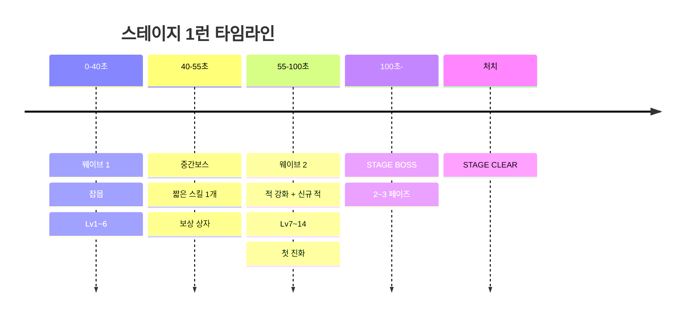

# 🦉 아울 서바이버즈 (OWL SURVIVORS) — 게임 기획 & 설계서 v2

> 아울게임즈 게임 ①. v1 폐기 후 전면 재설계.
> 상위 문서 `OWLGAMES_SPEC.md` + 본 문서 §16(스펙 변경)을 함께 적용할 것.
> DB `game_id` = **`survive`**. 표시명 **아울 서바이버즈**.

---

## 1. 개요

| 항목 | 값 |
|---|---|
| 장르 | 탑다운 오토배틀 로그라이트 |
| 한 줄 | **"살아남아 보스를 잡아라. 스킬은 쌓을수록 진화한다."** |
| 목표 | **생존 + 스테이지 보스 처치** (보스를 잡아야만 다음 스테이지 해금) |
| 구성 | **스테이지 1~15 + 16단계부터 무한 스테이지** |
| 1판 | **한 스테이지 = 한 런.** 90~180초 |
| 조작 | 이동만 (WASD / 가상 조이스틱). **공격은 전부 자동** |
| 화면 | **가로 고정** (세로 감지 시 회전 안내 오버레이) |
| 테마 | 밝은 버전 / 어두운 버전 **진입 시 선택** |

### 핵심 설계 원칙
1. **한 런에 15스테이지를 다 돌지 않는다.** 스테이지 하나 = 런 하나. 부스 회전율(평균 2분)과 세션 상한이 여기서 결정된다.
2. **보스를 못 잡으면 진행이 없다.** 시간만 버티는 게 아니라 화력을 만들어야 한다 → 스킬 선택이 실제로 중요해진다.
3. **스킬 50개, 쌓으면 진화.** 같은 스킬을 다시 고르면 레벨이 오르고, MAX + 짝 패시브면 진화한다. "내가 만든 빌드"가 결과 화면에 남는다.
4. **피격은 반드시 체감된다.** 화면 흔들림 + 전투 로그. 왜 죽었는지 항상 읽힌다.

---

## 2. 조작 / 화면

| 플랫폼 | 이동 | 비고 |
|---|---|---|
| PC | `WASD` / 방향키 | 스킬 선택 `1` `2` `3`, 리롤 `R` |
| 모바일 | **왼쪽 절반 가상 조이스틱** (터치 지점이 원점, 반경 60px, 화면 어디든 생성) | 선택은 카드 탭 |

- **가로 고정 960×540.** 세로면 `📱 가로로 돌려주세요` 오버레이 + 게임 일시정지.
- 액티브 스킬도 **전부 자동 발동**. 버튼 없음. (버튼이 생기는 순간 모바일에서 난이도가 조작 난이도로 변질된다)
- 레벨업 카드가 뜨면 게임 전체 정지.

---

## 3. 런 구조 (스테이지 1개 = 1런)



| 구간 | 내용 |
|---|---|
| 웨이브 1 | 기본 적. 레벨업 6~7회 — 빌드의 뼈대를 잡는 구간 |
| **중간보스** | HP 낮고 **짧은 스킬 1개**만 씀. 처치 시 **보상 상자**(스킬 1개 즉시 Lv+2 또는 진화 재료) |
| 웨이브 2 | 적 강화 + 스테이지 고유 적 등장 |
| **스테이지 보스** | 처치해야 클리어. 페이즈마다 패턴 변경 |
| 하드캡 | **180초 초과 시 강제 종료**(실패 처리, 점수는 인정) |

- 보스 처치 전 사망 → 실패. 그 시점까지의 점수는 그대로 지급
- 클리어 → 다음 스테이지 해금 (`profiles.meta.survive_stage`)
- 이미 클리어한 스테이지는 자유 재선택 가능

---

## 4. 스테이지 1~15

적 체력·공격력은 스테이지마다 누적 증가: **HP ×(1 + 0.18×(S-1))**, **ATK ×(1 + 0.12×(S-1))**

| S | 이름 | 신규 적 | 중간보스 (짧은 스킬) | **스테이지 보스** (주요 패턴) |
|---|---|---|---|---|
| 1 | 서버실 B1 | 버그, 웜 | 버그 알파 — 짧은 돌진 | 🐛 **버그 퀸** — 분열 소환 / 산란 장판 |
| 2 | 전력 분전실 | 스파크 | 스파크 코어 — 전격 1회 | ⚡ **과부하 코어** — 방사형 전격 / 감전 장판 |
| 3 | 냉각탑 | 프로스트봇 | 아이스 웜 — 냉기 브레스 | ❄️ **프로즌 데몬** — 둔화 장판 / 고드름 낙하 |
| 4 | 배선 미로 | 배선벌레 | 케이블 헤드 — 채찍 | 🕸️ **케이블 나가** — 회전 채찍 / 감전 그물 |
| 5 | 데이터 아카이브 | 트로이목마 | 목마 유닛 — 소환 1회 | 🐴 **트로이 킹** — 대량 소환 / 위장 분신 |
| 6 | 통신 중계실 | 봇넷 | 노드 마스터 — 유도탄 | 📡 **봇넷 마스터** — 무리 호출 / 신호 레이저 |
| 7 | 폐기물 처리장 | 랜섬웨어 | 락 유닛 — 구속 장판 | 🔒 **랜섬 락** — 이동 봉쇄 장판 / 시간 압박(HP 흡수) |
| 8 | 보안 관제실 | 스파이웨어 | 아이 드론 — 추적 시선 | 👁️ **스파이웨어 아이** — 회전 시선 레이저 |
| 9 | 백업 볼트 | 미믹 | 미믹 상자 — 기습 | 🧿 **미믹 로드** — 분신 3체(진짜 1) |
| 10 | 루트 코어 | 루트킷 | 섀도 유닛 — 은신 | 🌑 **루트킷** — 은신 후 기습 / 무적 페이즈 |
| 11 | 채굴장 | 마이너봇 | 해시 유닛 — 자가회복 | 💰 **크립토 마이너** — 체력 흡수 / 광물 장애물 생성 |
| 12 | 제로데이 랩 | 익스플로잇 | 페이로드 — 랜덤 탄 | 💥 **제로데이** — 매 페이즈 패턴 랜덤 |
| 13 | 웜홀 게이트 | 워프봇 | 게이트 유닛 — 단거리 순간이동 | 🕳️ **웜홀** — 순간이동 / 블랙홀 흡입 |
| 14 | APT 요새 | 정예 혼합 | 정찰 대장 — 표식 | 🎯 **APT 핸들러** — 이전 보스 패턴 3종 혼합 |
| 15 | 루트 오버로드 | 전체 | 가디언 — 방벽 | 👹 **루트 오버로드** — **3페이즈 최종보스** |

### 최종보스 (S15) 3페이즈
1. **스캔** — 회전 레이저 + 잡몹 소환
2. **오버클럭** — 돌진 + 폭발 장판, 이동속도 증가
3. **커널 패닉** — 화면 절반 장판, 안전지대 2곳만, 60초 내 처치 못 하면 즉사기

---

## 5. 무한 스테이지 (16+)

| 항목 | 규칙 |
|---|---|
| 해금 | S15 클리어 |
| 진행 | 한 런 = 한 스테이지 (동일). 스테이지 번호만 계속 올라감 |
| 스케일 | **HP ×(1 + 0.18×(S-1))**, **ATK ×(1 + 0.12×(S-1))** 그대로 연장 |
| 보스 | **5스테이지마다 기존 보스 강화판**(패턴 2개 추가), 그 사이는 랜덤 보스 |
| 특수 규칙 | 3스테이지마다 하나: 🌑 시야 제한 / 🩸 회복 반감 / 💨 적 이동속도 +30% / 🎯 엘리트 2배 |
| 점수 배율 | `1.0 + (S-1) × 0.06` (상한 ×3.0) |
| 랭킹 | **최고 도달 스테이지**가 이 게임의 대표 지표 |

---

## 6. 스킬 시스템

### 6.1 규칙
- **슬롯: 액티브 6 / 패시브 6**
- 레벨업 시 **카드 3장 중 1장 선택**. 같은 스킬을 또 고르면 **Lv +1** (Lv5가 MAX)
- 레벨업 XP: `10 + 7 × L`
- **리롤 1회 / 스킵 1회** (런당, 무료). 스킵 시 XP 10% 즉시 획득
- **진화(연계):** 액티브 **Lv5(MAX)** + 지정 패시브 **Lv3 이상** → 다음 레벨업에 ⭐진화 카드가 **1번 슬롯 고정**으로 등장
- 슬롯이 가득 차면 보유 스킬 강화 카드만 등장

### 6.2 속성 연계 (스킬 간 상호작용)
| 조합 | 효과 |
|---|---|
| ❄️ 둔화 상태 + ⚡ 전기 피해 | 피해 **×2** (감전 증폭) |
| 🔥 화상 상태 + 💥 폭발 | 화상 확산 (주변 3체) |
| 🕳️ 흡입 상태 + 광역기 | 광역 피해 **+50%** |
| 🎯 표식 상태 + 관통 | 관통 시 치명타 확정 |

---

## 7. 스킬 50종 전체 목록

### 🗡️ 액티브 20종

| # | 스킬 | 유형 | 효과 (Lv1 → Lv5) |
|---|---|---|---|
| A01 | 🪶 **깃털 표창** *(시작 스킬)* | 추적 투사체 | 가장 가까운 적에게 발사. 1발/0.8초 → 3발/0.5초 |
| A02 | 🔫 **블래스터** ⭐요청 | 관통 레이저 | 조준 방향으로 관통 레이저. 1.6초 → 0.9초, 관통 3 → 전체 |
| A03 | 🛡️ 방화벽 오라 | 지속 장판 | 주변 원형 지속 피해. 반경 70 → 130 |
| A04 | 📡 패킷 스니퍼 | 직선 빔 | 좌우 관통 빔 연사 |
| A05 | 🛰️ 포트 스캐너 | 궤도 위성 | 주위를 도는 위성 2 → 5개 |
| A06 | 🍯 하니팟 | 설치·유인 | 바닥 설치, 적 유인 후 폭발 |
| A07 | 💉 백신 | 회복·광역 | 8초마다 체력 회복 + 주변 피해 |
| A08 | ⚡ DDoS 난사 | 탄막 | 무작위 방향 난사, 초당 2 → 7발 |
| A09 | 🧨 로그 폭탄 | 조건 발동 | 40킬마다 화면 전체 폭발 (→ 20킬) |
| A10 | 🌀 소켓 루프 | 부메랑 | 왕복 투사체, 귀환 시 재타격 |
| A11 | ❄️ 쿨링 팬 | 원뿔·둔화 | 전방 냉각, 적 **둔화** 부여 |
| A12 | 🔗 체인 핑 | 연쇄 번개 | 적 사이 3 → 8회 연쇄, **전기** |
| A13 | 🕳️ 널 포인터 | 흡입 장판 | 블랙홀 생성, 적 **흡입** |
| A14 | 🧱 프록시 드론 | 소환 | 따라다니는 드론이 자동 사격 |
| A15 | 💣 커널 봄 | 투척 폭발 | 지연 폭발 대형 폭탄, **폭발** |
| A16 | 🔇 샌드박스 | 제어 | 장판 내 적 행동 정지 1.5초 |
| A17 | ⚔️ 루트 권한 | 근접 | 주변 원형 베기, 근접 고화력 |
| A18 | 🌐 브로드캐스트 | 파동 | 링 파동 + 넉백 |
| A19 | 🔥 페이로드 화염 | 도트 장판 | 화염 장판, **화상** 부여 |
| A20 | 🧊 캐시 미스 | 폭격 | 무작위 지점 낙하 폭격 |

### 🧠 패시브 18종

| # | 스킬 | 효과 (레벨당) |
|---|---|---|
| P01 | 🧠 코어 | 피해 +12% |
| P02 | ⏱️ CPU 클럭 | 쿨다운 -8% |
| P03 | 💾 RAM | 투사체 +1 (2레벨마다) |
| P04 | 📶 대역폭 | 투사체 속도·사거리 +15% |
| P05 | 🧱 방화벽 두께 | 최대 체력 +20, 받는 피해 -4% |
| P06 | 🧲 자석 | XP 획득 반경 +30% |
| P07 | 👟 부츠 | 이동속도 +9% |
| P08 | 🎯 정밀 조준 | 치명타 확률 +6% |
| P09 | 💥 오버플로우 | 치명타 피해 +25% |
| P10 | 🔋 배터리 | 액티브 지속시간 +15% |
| P11 | ♻️ 가비지 컬렉터 | 처치 시 4% 확률로 체력 +2 |
| P12 | 🩹 오토 힐 | 초당 체력 +0.4 |
| P13 | ❤️‍🩹 **리스폰 프로토콜** ⭐요청 | **사망 시 1회 부활 + 1초 무적** (Lv당 무적 +0.4초, Lv5에서 부활 시 HP 60% 회복) |
| P14 | ⏳ 타임아웃 | 피격 무적시간 +0.15초 |
| P15 | 📈 러닝 레이트 | 획득 XP +12% |
| P16 | 🔁 리트라이 | 8% 확률로 스킬 쿨다운 즉시 초기화 |
| P17 | ⚖️ 로드밸런서 | 액티브 1개가 추가 타격 (분산 공격) |
| P18 | 🌑 스텔스 캐시 | 5초간 무피격 시 피격 1회 무효 쉴드 자동 충전 |

### ⭐ 진화 12종 (연계 조합)

| # | 진화체 | 조건 | 효과 |
|---|---|---|---|
| E01 | 🌪️ **깃털 폭풍** | A01 MAX + P03 Lv3 | 8방향 전탄 난사, 사거리 2배 |
| E02 | 🌠 **오비탈 블래스터** | A02 MAX + P04 Lv3 | 화면 전체 관통 + 이동 중 조준 유지, 관통마다 피해 증가 |
| E03 | 🔰 **제로 트러스트** | A03 MAX + P05 Lv3 | 반경 2배 + 넉백 + 투사체 반사 |
| E04 | 🔦 **백본 레이저** | A04 MAX + P08 Lv3 | 3줄기 빔, 치명타 시 화상 |
| E05 | 🛸 **봇넷 오비탈** | A05 MAX + P01 Lv3 | 위성 8개 + XP 자동 흡수 |
| E06 | 🍯 **허니 클러스터** | A06 MAX + P06 Lv3 | 연쇄 폭발 (최대 5회) |
| E07 | 🧬 **자동 면역** | A07 MAX + P12 Lv3 | 회복 2배 + 발동 시 0.6초 무적 |
| E08 | 🌩️ **뇌우 프로토콜** | A12 MAX + P02 Lv3 | 연쇄 무제한 + 둔화 적에게 ×3 |
| E09 | 🌌 **싱귤래리티** | A13 MAX + P09 Lv3 | 블랙홀 지속 2배 + 흡입 중 피해 +100% |
| E10 | 🐝 **드론 스웜** | A14 MAX + P17 Lv3 | 드론 3기 + 자동 표식 |
| E11 | ⚡ **커널 러시** | A17 MAX + P07 Lv3 | 돌진 베기, 돌진 중 무적 |
| E12 | 🔄 **페일오버 클러스터** | P13 MAX + P14 Lv3 | **부활 2회 + 부활 시 3초 무적 + 화면 전체 폭발** |

> **총 50종** (액티브 20 + 패시브 18 + 진화 12)
> 한 런(90~180초)에서 현실적으로 **Lv 14~20, 진화 1~2개**가 한계가 되도록 XP 곡선을 맞춘다. "한 번만 더 하면 2개 뚫는다"가 재시도 동기.

### 카드 추첨 규칙
1. 진화 가능하면 **1번 슬롯 고정**(⭐, 황금 테두리 + 전용 효과음)
2. Lv6 이전에는 신규 액티브 최소 1장 보장
3. Lv10 이후 신규 스킬 등장 확률 40%로 하향 (빌드 완성 유도)
4. 동일 카드 3회 연속 등장 금지
5. 체력 30% 이하면 P05/P12/P13 가중치 2배 (자연스러운 구제)

---

## 8. 장애물 (맵 오브젝트)

빈 공간 문제 해결 + 전술 요소.

| 항목 | 규칙 |
|---|---|
| 종류 | 🗄️ 서버랙(HP 30) / 📦 자재 박스(HP 15) / 🧯 소화기(HP 10, 파괴 시 소형 폭발) / 🪵 배선 더미(HP 20) |
| 배치 밀도 | **맵 면적의 6~9%만.** 절대 초과 금지 |
| 배치 규칙 | 통로 폭 **최소 140px** 보장, 플레이어 스폰 반경 200px 내 배치 금지, 3개 이상 밀집 금지 |
| 충돌 | 플레이어·적 **모두** 통과 불가 → 적을 우회시키는 전술 가능 |
| 파괴 | 플레이어 공격으로 파괴. **XP 조각 1~3개 드랍**, **12% 확률로 ❤️ 체력 회복(+8)** |
| 리젠 | 스테이지당 최초 배치만. 파괴된 자리는 비워둠 |
| 보스전 | 보스 등장 시 장애물 **40% 자동 제거** (보스 패턴 가림 방지) |

> **밀도 상한이 이 시스템의 핵심.** 9%를 넘기면 이동이 답답해지고 오토배틀의 쾌감이 죽는다. 수치를 config로 빼고 테스트에서 조정할 것.

---

## 9. 피격 연출 + 전투 로그

### 9.1 피격 연출
| 상황 | 연출 |
|---|---|
| 일반 피격 | **화면 흔들림 0.25초(강도 6px)** + 적색 비네트 + 무적 0.8초 |
| 보스 강공격 | 흔들림 0.4초(강도 12px) + 화면 플래시 |
| 체력 30% 이하 | 화면 가장자리 상시 적색 맥동 + 심박음 |
| 부활 발동 | 화면 백색 플래시 + 1초 무적 링 + 로그 강조 |
| 진화 획득 | 정지 0.6초 + 황금 방사 연출 |

> `prefers-reduced-motion` 설정 시 흔들림 → **테두리 플래시로 대체**.

### 9.2 전투 로그 (터미널 스타일)
화면 **우하단**, 최근 5줄, 3초 후 페이드. IT 컨셉과 가장 잘 맞는 UI.

```
[WARN]  트로이목마 → 12 피해   HP 68/100
[INFO]  Lv.12  스킬 선택 가능
[EVO]   ⭐ 깃털 폭풍 진화 완료
[CRIT]  블래스터 치명타 248
[DROP]  서버랙 파괴 → ❤️ +8
[ALERT] STAGE BOSS: 버그 퀸 등장
[FATAL] HP 0 — 리스폰 프로토콜 발동 (무적 1.0s)
```
| 태그 | 색(다크/라이트) | 용도 |
|---|---|---|
| `INFO` | 회색 / 회색 | 레벨업, 획득 |
| `WARN` | 앰버 / 주황 | 피격 |
| `CRIT` | 사이안 / 파랑 | 치명타·대미지 하이라이트 |
| `DROP` | 초록 / 초록 | 드랍 |
| `EVO` | 금색 / 금색 | 진화 |
| `ALERT` | 자주 / 자주 | 보스 등장·페이즈 전환 |
| `FATAL` | 적색 / 적색 | 사망·부활 |

---

## 10. 디자인 전면 수정

### 10.1 테마 선택 (진입 화면)
게임 시작 전 **다크 / 라이트 선택**. 선택값은 `profiles.meta.survive_theme`에 저장하고 다음 판에 기본값으로 사용.

```ts
const THEME = {
  dark: {
    bg:'#0B1020', grid:'#151C30', surface:'#141B33',
    text:'#E8EDF7', dim:'#8A94AD',
    player:'#FFB020', enemy:'#FF5C7A', boss:'#C084FC',
    xp:'#3DD9EB', hp:'#4ADE80', obstacle:'#3A4463',
    accent:'#FFB020', danger:'#FF3B5C',
  },
  light: {
    bg:'#F4F6FB', grid:'#E3E8F2', surface:'#FFFFFF',
    text:'#141B33', dim:'#5A6479',
    player:'#B45309', enemy:'#D92B50', boss:'#7C3AED',
    xp:'#0891B2', hp:'#16A34A', obstacle:'#B8C0D4',
    accent:'#B45309', danger:'#DC2626',
  },
};
```
**라이트 테마 주의:** 밝은 배경에서는 발광 효과가 안 보인다. 라이트에서는 **발광 대신 외곽선(2px) + 그림자**로 형태를 표현할 것. 두 테마 모두 적/플레이어/장판의 명도 대비 **4.5:1 이상** 확보.

### 10.2 화면 레이아웃 (가로 960×540)
```
┌─────────────────────────────────────────────────────┐
│ ❤️❤️❤️♡♡  HP 68/100      ⏱ 1:42     STAGE 7  KILL 412│ ← 상단바 (높이 44)
│ XP ████████████░░░░░░░  Lv.12                        │ ← XP 바 (높이 8)
│                                                      │
│                    [ 플레이 영역 ]                    │
│                                                      │
│                                     [WARN] 12 피해   │
│ 🗡️🔫🛡️📡·· 🧠⏱️💾····          [EVO] 깃털 폭풍     │ ← 하단: 스킬 슬롯 / 로그
└─────────────────────────────────────────────────────┘
        ⊙ 조이스틱(모바일, 왼쪽 절반 어디든)
```
- HUD 총 면적 **15% 이하**
- 스킬 슬롯은 아이콘 + 레벨 점(`•••••`), 진화된 스킬은 금색 테두리
- 보스전에는 상단에 **보스 HP 바 + 페이즈 표시** 추가

### 10.3 아트 방향
- **도형 기반 미니멀**. 부엉이=원+삼각 귀, 적=다각형(등급별 변 개수: 버그 3각, 웜 4각, 정예 6각, 보스 8각+코어). 이모지 의존 최소화
- 적 피격 시 **0.08초 백색 플래시** (타격감의 90%가 여기서 나온다)
- 투사체는 잔상 3프레임
- 바닥은 **격자 패턴 + 스테이지별 액센트 컬러**로 스테이지 구분
- 폰트: 숫자·로그 JetBrains Mono, UI Pretendard

### 10.4 레벨업 카드 UI
```
┌──────────┐ ┌──────────┐ ┌──────────┐
│    ⭐    │ │    🔫    │ │    🧠    │
│ 깃털 폭풍 │ │ 블래스터  │ │  코어    │
│  진화     │ │ Lv2 → 3  │ │ 신규     │
│8방향 난사 │ │쿨다운 -15%│ │피해 +12% │
└──────────┘ └──────────┘ └──────────┘
   [ 🔄 리롤 1 ]   [ ⏭️ 스킵 ]
```
카드 크기는 **세로 화면 기준으로도 탭하기 쉽게** 최소 높이 180px, 간격 16px.

---

## 11. 점수 → 포인트 연동 ★

### 11.1 원점수
```
raw = (kills × 3
     + survived_sec × 6
     + level × 40
     + evolutions × 300
     + midboss_killed × 250
     + stage_cleared × 1000        // 보스 처치 시에만
     + obstacles_destroyed × 8
     + no_damage_bonus 500)
     × stage_mult                  // 1~15: 1.0 + (S-1)×0.06 / 무한: 동일 연장, 상한 ×3.0
```

### 11.2 플랫폼 환산
`points = 30 + min(270, floor(raw / K))`, **`K_survive = 20`**

| 수준 | 내용 | raw | 획득 |
|---|---|---|---|
| 첫 판 | S1 보스 실패, 80초 생존, Lv8 | ~900 | **75P** |
| 익숙 | S5 클리어, 150초, Lv15, 진화 1 | ~3,400 | **200P** |
| 숙련 | S12 클리어, 진화 2, 무피격 | 9,000+ | **300P (상한)** |

### 11.3 서버 검증 meta
```jsonc
{ "stage": 7, "cleared": true, "duration_s": 156.3, "kills": 512,
  "level": 17, "evolutions": 2, "midboss": true, "obstacles": 14,
  "damage_taken": 3, "revives_used": 1, "theme":"dark",
  "build": ["E01","A02:5","P03:4","P13:2"], "device":"mobile", "v":"2.0.0" }
```
**거부 조건**
- `duration_s` < 20 또는 > **200**
- `kills` > `duration_s × 8`
- `level` > 24, `evolutions` > 3
- `cleared: true` 인데 `duration_s` < 90 (보스 등장 전 클리어 불가)
- `stage` > 유저 해금 단계 + 1
- `no_damage_bonus` 인데 `damage_taken` > 0
- 메타 재계산 raw와 ±5% 초과 불일치 → **서버 재계산값 채택**

---

## 12. 결과 화면

```
━━━━━━━━━━━━━━━━━━━━━━━━
    🦉 아울 서바이버즈
    STAGE 7 CLEAR  ✅
━━━━━━━━━━━━━━━━━━━━━━━━
 보스        랜섬 락 처치
 생존        156초
 처치        512  (장애물 14)
 레벨        Lv.17
 피격        3회
━━━━━━━━━━━━━━━━━━━━━━━━
 내 빌드
  🗡️ 🌪️깃털폭풍  🔫블래스터5  🛡️방화벽3
  🧠 RAM4  코어3  리스폰2
  ⭐ 진화 2개
━━━━━━━━━━━━━━━━━━━━━━━━
 획득 포인트  +200 P
 Lv.41 ███████░░░ Lv.42
 🔓 STAGE 8 해금!
━━━━━━━━━━━━━━━━━━━━━━━━
 [ 다시하기 ]  [ 스테이지 선택 ]  [ 랭킹 ]
```
- **빌드 요약을 크게.** "내가 만든 것"이 남아야 다시 한다
- 실패 시 `☠️ 사망 — 랜섬 락 2페이즈` + 한 줄 팁
- 랭킹 탭: **최고 스테이지 / 최다 처치 / 최단 클리어**

---

## 13. 튜닝 상수

```ts
// /games/survive/config.ts
export const CFG = {
  player:{ hp:100, speed:190, iFrameSec:0.8, pickupRadius:70 },
  xp:{ curve:(L:number)=>10+7*L, maxLevel:24 },
  slots:{ active:6, passive:6 },
  card:{ choices:3, reroll:1, skip:1, skipXpRatio:0.1,
         newSkillRateAfterLv10:0.4, noRepeat:3 },
  evolution:{ activeMaxLv:5, passiveReqLv:3, forceTopSlot:true },
  wave:{ w1End:40, midbossAt:40, w2Start:55, bossAt:100, hardCapSec:180 },
  stage:{ count:15, hpPerStage:0.18, atkPerStage:0.12,
          multBase:1.0, multPerStage:0.06, multCap:3.0 },
  obstacle:{ densityMin:0.06, densityMax:0.09, minCorridorPx:140,
             spawnClearRadius:200, hpDropRate:0.12, hpDropAmount:8,
             bossClearRatio:0.4 },
  feedback:{ shakeSec:0.25, shakePx:6, bossShakeSec:0.4, bossShakePx:12,
             hitFlashSec:0.08, logLines:5, logFadeSec:3 },
  perf:{ maxEnemies:180, maxProjectiles:256, maxParticles:256,
         gridCell:64, fpsFloor:45 },
  platform:{ K:20, basePoints:30, maxBonus:270, maxSessionSec:200 },
} as const;
```

---

## 14. 구현 구조 / 성능

```
games/survive/
├─ index.tsx            # 테마 선택 → 스테이지 선택 → 세션 RPC → 결과
├─ config.ts  theme.ts
├─ data/
│  ├─ skills.ts         # 50종 정의 (효과는 데이터로, 로직은 핸들러 맵)
│  ├─ stages.ts         # 15 스테이지 + 무한 스케일 규칙
│  └─ bosses.ts         # 보스 패턴 FSM 정의
├─ engine/
│  ├─ loop.ts  world.ts  spatial.ts   # 공간 해시 그리드
│  ├─ spawner.ts        # 웨이브 테이블, 스폰 예산(초당 6)
│  ├─ skills/           # 스킬별 update(dt, world)
│  ├─ evolution.ts  levelup.ts
│  ├─ boss.ts           # 페이즈 FSM
│  ├─ obstacles.ts      # 밀도 검증 포함 배치
│  ├─ combatlog.ts
│  └─ render.ts
└─ ui/  (조이스틱, HUD, 카드, 로그, 결과)
```

**성능 (이 게임 최대 리스크)**
| 항목 | 방식 |
|---|---|
| 렌더 | Canvas 2D 단일 캔버스. DOM 금지 (로그·카드 UI만 DOM) |
| 스프라이트 | 오프스크린 프리렌더 후 `drawImage`. 매 프레임 path 금지 |
| 엔티티 | 구조체 배열 + 풀링(적 256 / 투사체 256 / XP 512 / 파티클 256). 런 중 `new` 금지 |
| 충돌 | 공간 해시 그리드(셀 64px) |
| XP 조각 | 화면 60개 초과 시 자동 병합 |
| 타임스텝 | 고정 1/60 + accumulator, 최대 3스텝/프레임 |
| 저사양 | fps<45 2초 지속 → 파티클 50% → 적 상한 120 |

---

## 15. 수용 기준

| # | 기준 |
|---|---|
| 1 | iPhone SE급에서 **적 150 + 투사체 100 동시 60fps** |
| 2 | 런 중 힙 증가 5MB 이하 (풀링 검증) |
| 3 | 스킬 50종 전부 구현·발동 확인, 진화 12종 조건 충족 시 **100% 등장** |
| 4 | 장애물 밀도가 항상 6~9% 이내이고 통로 폭 140px 이상 보장 |
| 5 | 보스 15종 패턴이 각각 정상 동작, 페이즈 전환 로그 출력 |
| 6 | 피격 시 흔들림 + 로그가 항상 동시 출력, `reduced-motion`에서 흔들림 미발생 |
| 7 | 라이트/다크 모두 명도 대비 4.5:1 이상, 라이트에서 발광 대신 외곽선 적용 |
| 8 | 세로 방향에서 회전 안내가 뜨고 게임이 정지 |
| 9 | 부활(P13) 발동 시 정확히 1초(+Lv당 0.4초) 무적 |
| 10 | 봇 시뮬 1,000런: S1 클리어율 70%↑, S7 클리어율 30~45%, 진화 도달률 35~55% |
| 11 | 조작된 meta(초당 20킬, 90초 미만 클리어) 100% 거부 |

---

## 16. 상위 스펙 변경 사항

```jsonc
// 1) game_id enum — 라인업 4종
create type game_id as enum ('survive','company','logic','phish');

// 2) app_config
"game_k": { "survive": 20, "company": 20, "logic": 20, "phish": 20 },
"game_limits": {
  "survive": { "min_sec": 20, "max_sec": 200 },
  "company": { "min_sec": 15, "max_sec": 210 },
  "logic":   { "min_sec": 10, "max_sec": 185 },
  "phish":   { "min_sec": 10, "max_sec": 185 }
},
"game_guards": {
  "survive": { "max_kills_per_sec": 8, "max_level": 24, "max_evolutions": 3,
               "min_clear_sec": 90 }
}

// 3) profiles.meta
{ "survive_stage": 7, "survive_theme": "dark", "company_unlock": 3 }
```

**라우트:** `/game/survive` (테마 선택 → 스테이지 선택 → 플레이)
**로비 카드 문구:** 🦉 아울 서바이버즈 — "살아남아 보스를 잡아라"

> ⚠️ 게임이 4종이 되면서 로비 카드 레이아웃이 2×2 그리드로 바뀐다. 모바일에서 카드 높이 조정 필요.

---

## 17. 추가 제안

| 기능 | 설명 | 우선순위 |
|---|---|---|
| **빌드 공유 코드** | 결과 빌드를 6자리 코드로 → 전광판 "오늘의 빌드" | 높음 |
| **관전 모드** | 부스 TV 실시간 미러링 (뱀서류는 구경이 재밌다) | 높음 |
| **보스 러시** | 클리어한 보스만 연속 3체, 45초 단판 — 대기줄 짧을 때 | 중간 |
| **스킬 도감** | 획득한 50종·진화 12종을 `/me`에 수집 | 중간 |
| **일일 챌린지** | 고정 시드 + 스킬 제한, 보너스 +150P | 중간 |
